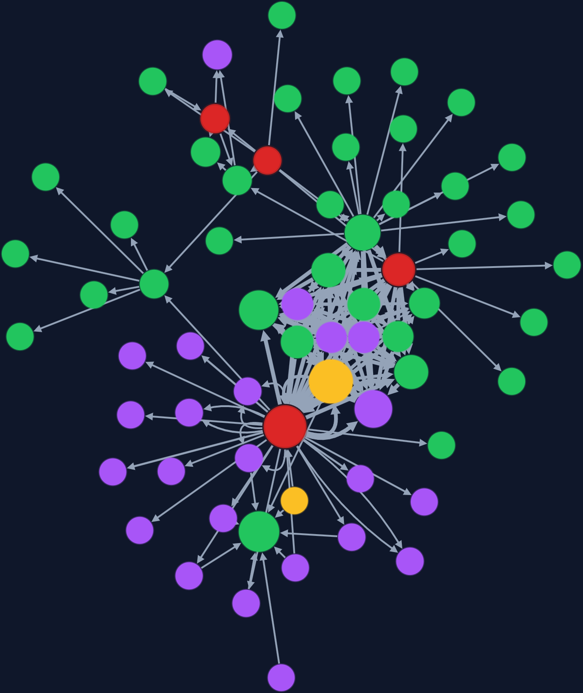
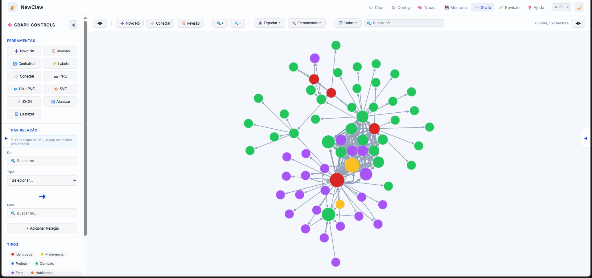
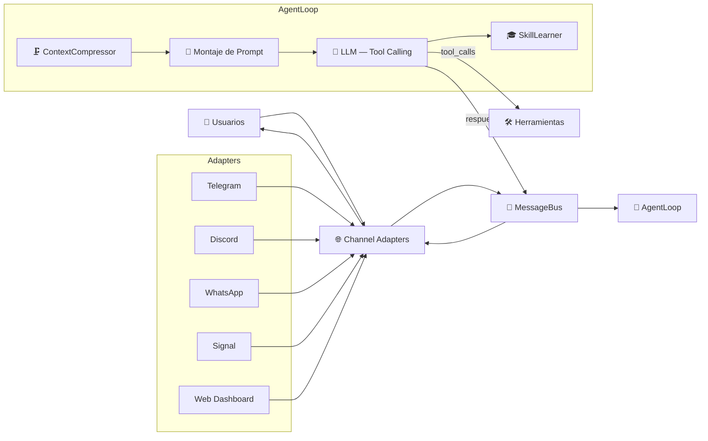

# NewClaw 🪐

> **Idiomas:**
> 🇺🇸 [English](README.md) | 🇧🇷 [Português](README.pt-br.md) | 🇪🇸 **Español**

[](https://opensource.org/licenses/MIT)
[](https://nodejs.org/)
[](https://github.com/rovanni/NewClaw)
[](https://github.com/rovanni/NewClaw/pulls)

---

> **Tú:** "Mi hija adora las matemáticas."
>
> *Dos días después:*
>
> **Tú:** "¿Qué sabes sobre mi familia?"
> **NewClaw:** "Tu hija adora las matemáticas."
>
> *Sin fine-tuning. Sin contexto inyectado manualmente. Sin repetirte.*

---

## El asistente de IA que realmente te recuerda

Hoy, todos los asistentes de IA olvidan todo en cuanto termina la sesión. Te repites constantemente. El contexto que construiste la semana pasada desapareció. El agente nunca aprende quién eres de verdad.

**NewClaw es diferente.**

Se ejecuta localmente en tu máquina, construye una memoria persistente sobre quién eres, y permanece contigo en Telegram, WhatsApp y Discord — incluso después de semanas o meses. El mismo agente. La misma memoria. Siempre.

---

## Vélo en acción

### Memoria que persiste a lo largo del tiempo

```
Tú: "Estoy trabajando en un proyecto llamado Orion — es un sistema de gestión de clientes."
NewClaw: "Entendido. Agregué Orion a tus proyectos conocidos."

[Una semana después]

Tú: "¿En qué proyectos estoy trabajando?"
NewClaw: "Tienes Orion — un sistema de gestión de clientes que mencionaste la semana pasada."
```

### Contexto que moldea las respuestas futuras

```
Tú: "Odio las reuniones antes de las 10 de la mañana."

[Unos días después]

Tú: "Agenda una reunión con el equipo para mañana."
NewClaw: "Voy a sugerir horarios después de las 10, ya que lo prefieres así."
```

### El mismo agente en todos lados

Envías un audio por Telegram en la mañana. Luego abres el dashboard web. Por la noche respondes desde Discord. Es el mismo NewClaw — con la misma memoria y el mismo contexto — en todos los canales.

---


*Grafo de memoria real — 65 nodos, 167 aristas. Etiquetas eliminadas por privacidad.*

---

## Instalación Rápida

**Linux/macOS:**
```bash
curl -fsSL https://raw.githubusercontent.com/rovanni/NewClaw/main/install.sh | bash
```

**Windows (PowerShell como Administrador):**
```powershell
irm https://raw.githubusercontent.com/rovanni/NewClaw/main/install.ps1 | iex
```

### Requisitos

- Windows 10 (1809+) / Windows 11, o Linux/macOS
- Node.js 22+ (el instalador lo instala automáticamente si falta)
- 2GB+ de RAM, 5GB+ de espacio libre en disco
- No se necesita ningún canal de chat para empezar — NewClaw funciona de forma
  independiente a través del Dashboard Web local (`http://localhost:3090`). Agrega
  Telegram, Discord, WhatsApp o Signal más adelante con `newclaw channels enable <canal>`.

### Solución de problemas de instalación

- **Windows — "no se puede cargar porque la ejecución de scripts está deshabilitada en este
  sistema"**: esto solo ocurre si descargaste el archivo y ejecutaste `.\install.ps1`
  directamente, en vez del comando `irm | iex` de arriba (que no sufre esta restricción).
  Solucionalo una vez con:
  ```powershell
  Set-ExecutionPolicy RemoteSigned -Scope CurrentUser
  ```
  Esto afecta solo tu cuenta de usuario, no toda la máquina, y también evita el mismo
  bloqueo en comandos `npm` más adelante. El instalador ya verifica y corrige esto
  automáticamente cuando logra ejecutarse.
- **Windows — PM2 no conecta / el bot no se mantiene activo**: normalmente es un daemon de
  PM2 iniciado con otro nivel de privilegios, dejado atrás (error `EPERM` en el named pipe).
  Ejecuta `newclaw doctor` para un diagnóstico completo, o usa `npm start` como alternativa
  (sin auto-restart, pero funciona).
- **`newclaw update` falla al compilar (error de TypeScript sobre un módulo faltante)**: el
  `npm install` se ejecuta automáticamente en cada update, así que esto debería ser raro —
  pero si pasa (ej: red inestable durante la instalación, o una dependencia nativa que falló
  al compilar), solucionalo a mano:
  ```bash
  cd <tu carpeta de instalación de NewClaw>
  npm install
  npm run build
  newclaw restart --daemon
  ```
- **En cualquier momento**: ejecuta `newclaw doctor` para revisar Node, PM2, Ollama, canales
  configurados, espacio en disco y el auto-inicio en Windows, todo de una vez.

---

## Cómo se compara NewClaw

| Otros asistentes | NewClaw |
|---|---|
| Olvida todo al terminar la sesión | Memoria persistente — recuerda por días, semanas, meses |
| Tus datos viven en servidores de terceros | 100% local — tus datos nunca salen de tu máquina |
| Una interfaz (generalmente solo un chat) | Telegram, WhatsApp, Discord, Signal, Web — un solo agente |
| Empieza de cero en cada conversación | Construye un modelo de mundo sobre ti que evoluciona con el tiempo |
| Requiere suscripciones costosas a APIs | Funciona con modelos locales (Ollama) con la nube como fallback opcional |

---

## Qué puedes hacer con él

- **Preguntar cualquier cosa sobre tu historial** — preferencias, decisiones, proyectos, personas que mencionaste
- **Usar cualquier canal** — Telegram, WhatsApp, Discord, dashboard web, o todos a la vez
- **Mantener tus datos privados** — 100% local, sin nube obligatoria
- **Dejar que aprenda tus patrones** — propone atajos basados en cómo trabajas realmente
- **Ejecutarlo en tu servidor** — servicio persistente en segundo plano, soporte SSH, multi-instancia

---

## Funcionalidades

| Feature | Lo que hace por ti |
|---|---|
| 🧠 **Memoria Semántica** | Recuerda personas, preferencias, proyectos, hechos — y las conexiones entre ellos |
| 🔀 **Multi-Canal** | Telegram, Discord, WhatsApp, Signal, Web — un agente en todos los canales |
| 🛡️ **Local-First** | Sin nube obligatoria. Sin recolección de datos. Se ejecuta en tu hardware |
| 🎓 **Aprendizaje de Skills** | Observa cómo trabajas y propone atajos reutilizables con el tiempo |
| 🔄 **Fallback de Proveedores** | Ollama → Gemini → DeepSeek → Groq — cambia automáticamente si uno falla |
| 📊 **Dashboard Web** | Grafo de memoria visual, chat en tiempo real, configuración completa |
| 🌐 **Búsqueda Web** | Investiga temas y sintetiza respuestas desde múltiples fuentes |
| 🖥️ **SSH Exec** | Ejecuta comandos en servidores remotos directamente desde el chat |
| 📸 **Snapshots de Memoria** | Versiona el conocimiento del agente — crea, restaura y compara estados |
| 🛡️ **Auto-Auditoría** | El agente inspecciona y corrige su propio runtime con `/audit` |

---


*Dashboard Web — visualización interactiva del grafo con tipos de nodo: Identidad, Preferencia, Proyecto, Contexto, Hecho, Habilidad.*

---

## Comandos CLI

| Comando | Descripción |
|---|---|
| `newclaw start` | Inicia el agente |
| `newclaw stop` | Termina el servicio de forma segura |
| `newclaw status` | Health check, PID y tiempo activo |
| `newclaw logs -f` | Registros en tiempo real |
| `newclaw update` | Actualiza y recompila el proyecto |
| `newclaw passwd` | Define o cambia la contraseña del Dashboard |
| `newclaw onboard` | Configura proveedores y claves de API |
| `newclaw channels` | Estado de los canales (Telegram, Discord, WhatsApp, Signal) |
| `newclaw channels enable <nombre>` | Activa un canal |
| `newclaw channels disable <nombre>` | Desactiva un canal |

---

## Auditor de Auto-Diagnóstico

NewClaw puede inspeccionar su propio código y comportamiento en tiempo de ejecución usando el LLM local.

> **Solo para el propietario.** Funciona en cualquier canal (Telegram, Discord, etc.).

| Comando | Descripción | Tiempo |
|---|---|---|
| `/audit` | Auditoría completa — código, runtime, datos, integraciones | ~1-3 min |
| `/audit fix` | Auto-corrección — aplica solo correcciones de bajo riesgo validadas | ~1-5 min |
| `/cancel` | Cancela la operación en curso (`/cancelar`, `/stop`, `/pare` también funcionan) | instantáneo |

---

<details>
<summary>⚙️ Cómo funciona internamente</summary>

### Flujo de Mensajes



Para la filosofía arquitectónica completa detrás de esto (por qué los canales nunca tocan lógica
de IA, qué está prohibido importar dónde, cómo agregar un canal nuevo), ver
[docs/ARCHITECTURE.md](docs/ARCHITECTURE.md).

### Sistema de Sesiones (v2)

| Componente | Propósito |
|---|---|
| **SessionTranscript** | Log JSONL append-only, cada evento grabado con número de secuencia y metadatos |
| **SessionManager** | Mutex por sesión, compresión híbrida (20 msgs o 3000 tokens) |
| **SessionContext** | Construye el contexto LLM: prompt → checkpoint → mensajes recientes → memoria semántica |
| **SessionLearner** | Extrae hechos de las conversaciones para el grafo cognitivo |

### Modos de Operación

El agente actúa en cuatro modos según la complejidad de la tarea:

1. 💬 **Responder** — Conversación natural usando contexto de largo plazo
2. 🔍 **Buscar** — Síntesis multi-fuente e investigación basada en evidencias
3. 🧭 **Explorar** — Navegación web activa e interacción profunda con páginas
4. ⚡ **Ejecutar** — Comandos directos en el sistema y operaciones de archivos

</details>

---

## Roadmap

El roadmap detallado está en [docs/ROADMAP.md](docs/ROADMAP.md).

## Licencia

MIT — [opensource.org/licenses/MIT](https://opensource.org/licenses/MIT)

---

*NewClaw — La IA que realmente te recuerda.* 🪐
