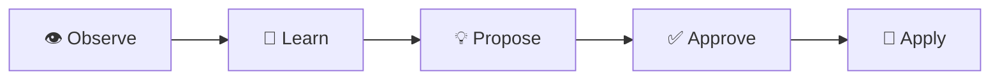
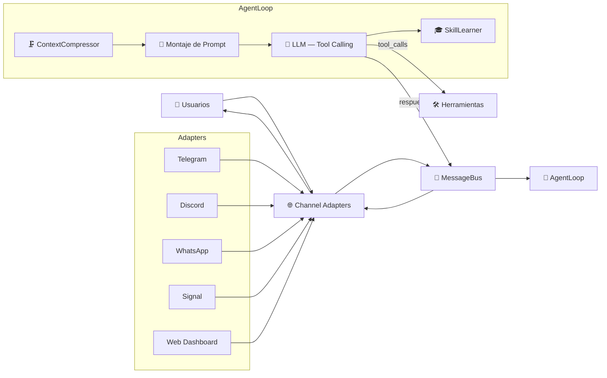

# NewClaw 🪐

> **Idiomas:**
> 🇺🇸 [English](README.md) | 🇧🇷 [Português](README.pt-br.md) | 🇪🇸 **Español**

[](https://opensource.org/licenses/MIT)
[](https://nodejs.org/)
[](https://github.com/rovanni/NewClaw)
[](https://github.com/rovanni/NewClaw/pulls)

### Agente cognitivo autónomo con tool-calling nativo, grafo de memoria semántica y fallback multi-proveedor.


NewClaw es un **Agente Cognitivo Avanzado** (100% local y privado), desarrollado en Node.js (TypeScript). Está especializado en la ejecución autónoma de tareas a través de llamadas a herramientas nativas y gestión de memoria semántica de largo plazo.

## 🔀 Arquitectura Multi-Canal
NewClaw posee una **arquitectura basada en MessageBus** que desacopla el núcleo cognitivo de las interfaces de comunicación. Esto permite que el agente mantenga una única memoria e identidad consistente mientras interactúa en múltiples plataformas simultáneamente:

*   **Pipeline Unificado**: Todos los mensajes son normalizados antes de llegar al agente.
*   **Identidad Persistente**: El agente es el mismo en Telegram, Discord o cualquier otro canal.
*   **Comandos Multi-Plataforma**: Comandos como `/clear` o `/skills` funcionan en todos los canales.
*   **Soporte de Medios**: Procesamiento nativo de texto, voz, fotos y documentos en todos los adaptadores.

## 🧠 Cognición Atómica: Núcleo de Decisión Unificado

El diferencial de NewClaw es su **Arquitectura de Cognición Atómica**. A diferencia de los agentes tradicionales que siguen una cadena lenta y lineal de etapas separadas, NewClaw procesa toda la inteligencia estratégica en un único turno atómico unificado:

1.  **Razonamiento Unificado**: El agente piensa, decide la acción y evalúa su propia completitud en una única respuesta JSON estructurada.
2.  **Eficiencia Extrema**: Elimina la latencia de múltiples llamadas LLM secuenciales, resolviendo tareas en solo 1 o 2 ciclos de decisión de alto valor.
3.  **Auto-Evaluación Nativa**: El cálculo de confianza y la validación de objetivos ocurren naturalmente dentro del razonamiento interno del modelo, sin supervisores externos.
4.  **Robusto y Resiliente**: Posee parsing avanzado de JSON con recuperación automática de errores de formato y filtraciones de markdown.
5.  **Limpio y Directo**: Prioriza respuestas útiles y basadas en evidencias sobre perfeccionismo estético o ejecución excesiva.

Esto garantiza que el agente **"piense una vez, pero piense profundo"**, ofreciendo autonomía de nivel profesional con el mínimo de latencia.

## 🚀 El Diferencial NewClaw

Lo que hace único a NewClaw es su enfoque en la **Consistencia Cognitiva de Largo Plazo** y **Confiabilidad Estructural**:

*   🛡️ **Privacidad Local-First**: Tus datos, memorias y modelos permanecen bajo tu control total, sin recolección de datos por terceros.
*   🗺️ **Modelo de Mundo Evolutivo**: A diferencia de los bots reactivos, NewClaw construye un grafo semántico persistente de tus preferencias, proyectos e infraestructura.
*   🏗️ **Razonamiento Estructural Nativo**: El agente no "adivina" cómo usar herramientas vía texto; utiliza llamadas de función nativas para interactuar con el sistema con precisión quirúrgica.
*   🔄 **Resiliencia Extrema**: Con una cadena de fallback multi-proveedor y enrutamiento inteligente, el sistema garantiza continuidad incluso si un proveedor o modelo falla.
*   🎓 **Auto-Optimización de Skills**: El agente observa patrones en su propia ejecución y propone nuevas habilidades reutilizables para ser más eficiente con el tiempo.

### 🔄 Ciclo de Aprendizaje
NewClaw no solo almacena datos; evoluciona. El sistema sigue un bucle continuo de optimización:

*Observar patrones → Aprender interacciones → Proponer skills → Aprobación del usuario → Aplicar en el futuro.*

## ⚙️ Modos de Operación
El agente actúa en cuatro modos distintos dependiendo de la complejidad de la tarea:
1.  💬 **Responder**: Conversación natural y razonamiento usando contexto de largo plazo.
2.  🔍 **Buscar**: Síntesis multi-fuente e investigación basada en evidencias.
3.  🧭 **Explorar**: Navegación web activa e interacción profunda con páginas.
4.  ⚡ **Ejecutar**: Comandos directos en el sistema y operaciones de archivos precisas.

## ✨ Funcionalidades

| Feature | Descripción |
|---------|-----------|
| 🧠 **Memoria Semántica** | SQLite + FTS5 + embeddings, 7 tipos de nodo, 14+ relaciones y curaduría avanzada. |
| 👁️ **Capa de Atención** | Sistema de priorización contextual que re-clasifica la memoria basado en el feedback. |
| 🔀 **Multi-Canal** | Soporte nativo para **Telegram, Discord, WhatsApp, Signal** y **Web**. |
| 📞 **Tool Calling Nativo** | Llamada estructural (Ollama/Gemini) para precisión absoluta sin parsing de texto. |
| 🧭 **Model Router** | Enrutamiento inteligente para modelos especializados (Chat, Code, Vision, Analysis). |
| 🔄 **Provider Fallback** | Resiliencia multi-proveedor: Ollama → Gemini → DeepSeek → Groq. |
| ⚖️ **Gobernanza de Memoria**| Memoria auto-regulada con decaimiento de confianza y archivado reversible. |
| 🎓 **SkillLearner** | Reconocimiento de patrones que alimenta el **Ciclo de Aprendizaje**. |
| 🌐 **Búsqueda Web** | Investigación iterativa multi-fuente con síntesis y lectura de páginas. |
| 🧭 **Exploración Activa** | Navegación web en modo terminal para interacción profunda (soporte a `w3m`). |
| 📊 **Dashboard Web** | Chat en tiempo real, configuración, curaduría de memoria y grafo interactivo. |
| 📸 **Snapshots** | Versionado del grafo: crear, restaurar, listar y eliminar snapshots. |
| 🖥️ **SSH Exec** | Ejecución remota de comandos vía SSH para infraestructura multi-servidor. |
| 🛡️ **Auditor de Auto-Diagnóstico** | Comando `/audit` (owner-only): verifica código, ejecución y auto-corrección. |

## 🏗️ Arquitectura

### Flujo de Mensajes



### Sistema de Sesiones (v2)

NewClaw utiliza una **arquitectura de sesión basada en eventos** para garantizar continuidad total en la conversación:

| Componente | Propósito |
|-----------|---------|
| **SessionTranscript** | Log JSONL append-only, cada evento grabado con metadatos |
| **SessionManager** | Mutex por sesión, compresión híbrida (20 msgs o 3000 tokens) |
| **SessionContext** | Construye el contexto LLM: prompt → checkpoint → mensajes → memoria |
| **SessionLearner** | Extrae hechos de las conversaciones para el grafo cognitivo |

## 🚀 Instalación

### Instalación Rápida — Linux/macOS (Recomendado)

```bash
curl -fsSL https://raw.githubusercontent.com/rovanni/NewClaw/main/install.sh | bash
```

### Instalación Rápida — Windows 🪟

**Ejecuta PowerShell como Administrador:**

```powershell
irm https://raw.githubusercontent.com/rovanni/NewClaw/main/install.ps1 | iex
```

### Comandos CLI

| Comando | Descripción |
|---|---|
| `newclaw start` | Inicia el agente |
| `newclaw stop` | Termina el servicio de forma segura |
| `newclaw status` | Comprobación de salud y tiempo de actividad |
| `newclaw logs -f` | Registros en tiempo real |
| `newclaw update` | Actualiza y recompila el proyecto |

---

## 🛡️ Auditor de Auto-Diagnóstico

NewClaw incluye un **Agente de Auto-Diagnóstico** que utiliza el LLM local para analizar su propio código y comportamiento.

> **💡 Cómo usar:** El comando `/audit` funciona en **cualquier canal** (Telegram, Discord, etc.). Está **restringido al propietario**.

| Comando | Descripción | Tiempo |
|---------|-----------|-------|
| `/audit` | Auditoría completa (código + ejecución + datos + integración) | ~1-3 min |
| `/audit fix` | **Auto-corrección** — solo aplica correcciones de bajo riesgo validadas | ~1-5 min |

---

## 🗺️ Roadmap
El roadmap detallado del proyecto se puede encontrar en [docs/ROADMAP.md](docs/ROADMAP.md).

## 📄 Licencia
Este proyecto está bajo la licencia MIT.

---
*NewClaw — El Futuro de los Agentes Cognitivos Locales* 🪐
