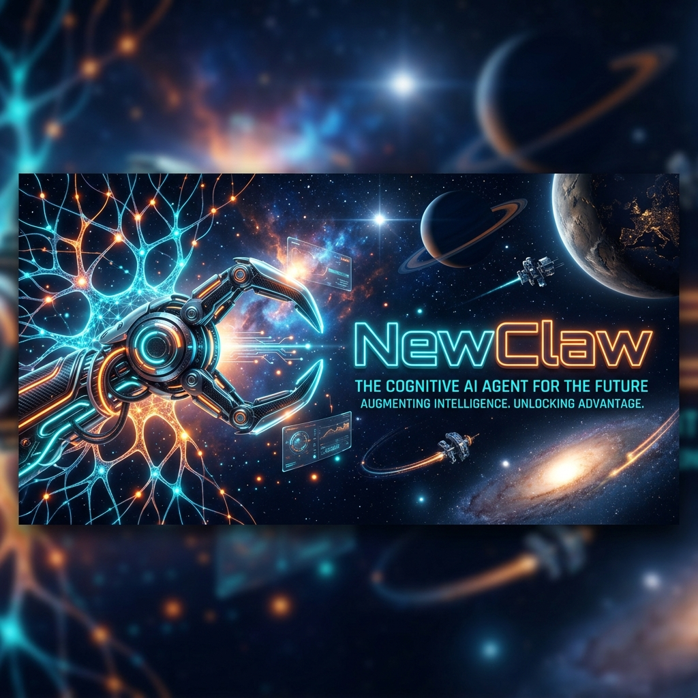
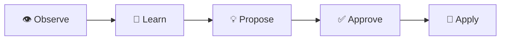
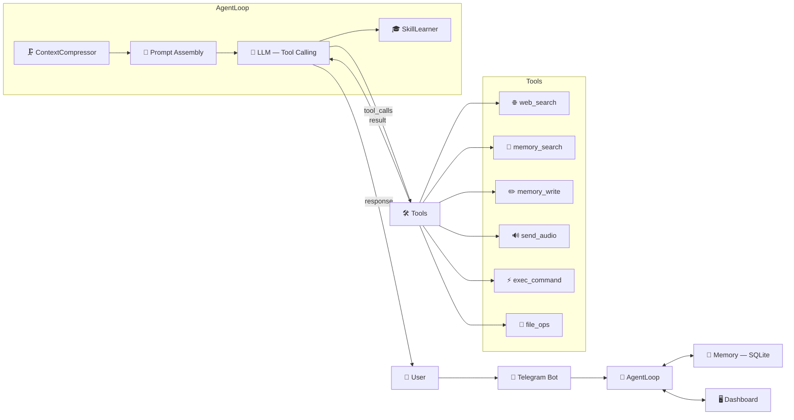
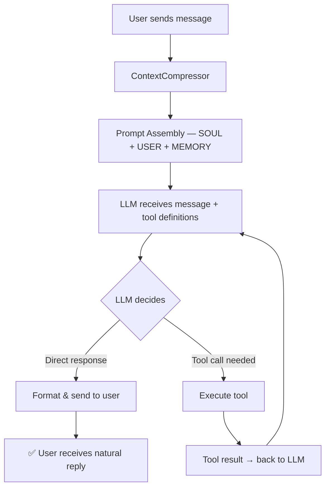
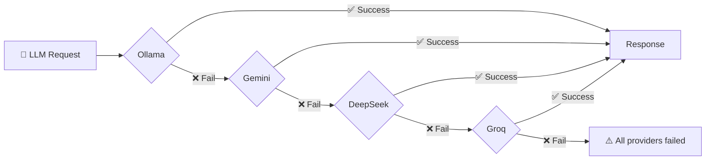
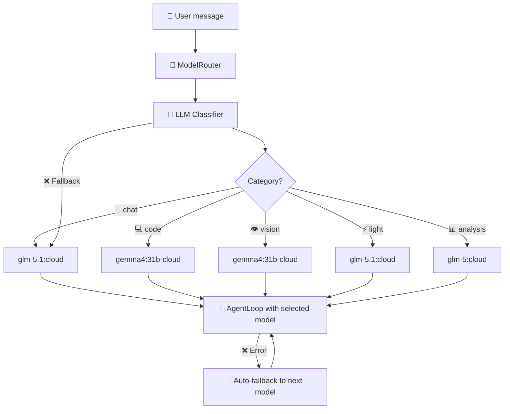
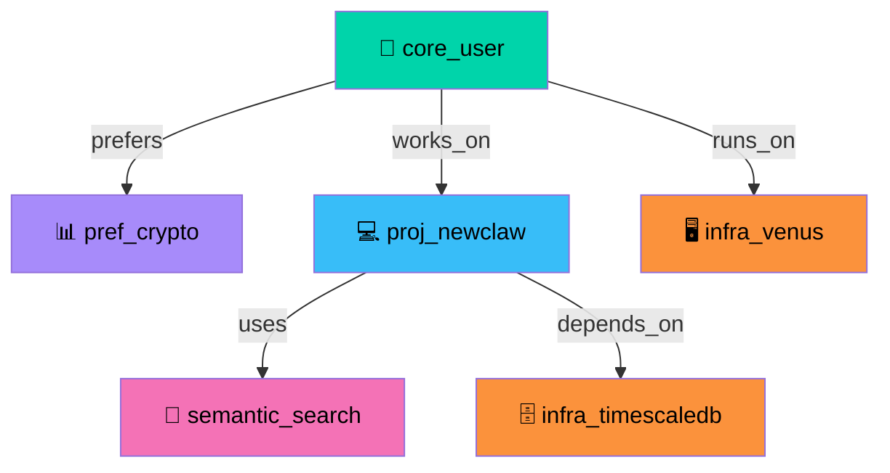
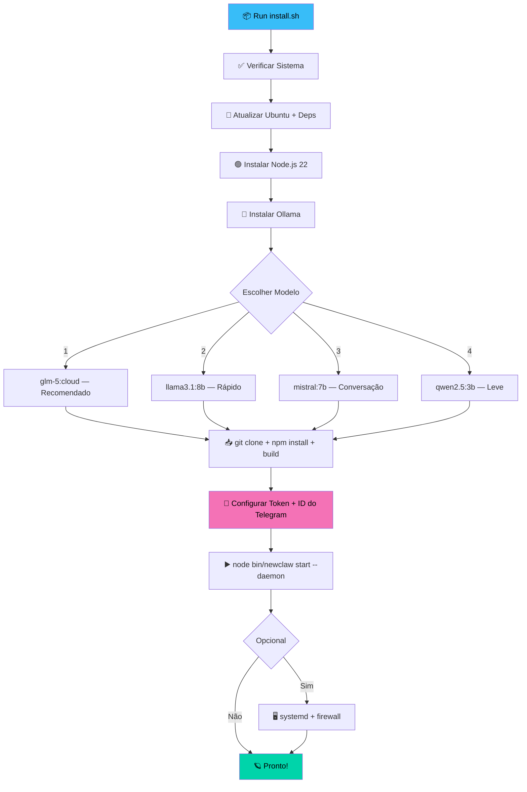

<a name="inicio"></a>
<a name="english"></a>
**[English Version](#english)** | **[Versão em Português](#português)**
# NewClaw 🪐

A local cognitive agent with semantic memory, native tool calling, and a Telegram interface.



NewClaw is a local-first cognitive system built with Node.js and TypeScript. It combines persistent semantic memory, native tool calling, multi-provider fallback, and a web dashboard so the agent can reason over context, use tools structurally, and keep long-term knowledge across interactions.

Instead of acting like a simple reactive bot, NewClaw maintains an evolving world model with identities, preferences, projects, facts, and infrastructure represented as a semantic graph. That allows the agent to respond with more continuity, make better decisions, and reuse context over time.

Inspired by [Hermes Agent](https://github.com/NousResearch/Hermes-Agent) and [OpenClaw](https://github.com/openclaw/openclaw).

## 🚀 The NewClaw Edge

What sets NewClaw apart is its focus on **Long-Term Cognitive Consistency** and **Structural Reliability**:

*   🛡️ **Local-First & Private**: Your data, memories, and models stay under your control. No third-party data harvesting.
*   🗺️ **Evolving World Model**: Unlike reactive bots that treat every session as new, NewClaw builds a persistent semantic graph of your preferences, projects, and infrastructure.
*   🏗️ **Native Structural Reasoning**: It doesn't "guess" how to use tools through text parsing. It uses native function calling to interact with the world with surgical precision.
*   🔄 **Extreme Resilience**: With a multi-provider fallback chain and an intelligent model router, the system ensures continuity even if a specific model or provider fails.
*   🎓 **Self-Optimizing Skills**: The agent doesn't just perform tasks; it observes patterns in its own execution and proposes new, reusable skills to become more efficient over time.

### 🔄 The Learning Cycle
NewClaw doesn't just store data; it evolves. The system follows a continuous optimization loop:

*Observe patterns → Learn interactions → Propose reusable skills → User approval → Apply in future tasks.*

## ⚙️ Core Operation Modes
The agent operates in four distinct modes depending on the task complexity:
1.  💬 **Respond**: Natural conversation and reasoning using long-term context.
2.  🔍 **Search**: Multi-source synthesis and evidence-based research.
3.  🧭 **Explore**: Active web navigation and deep page interaction.
4.  ⚡ **Execute**: Direct system commands and precise file operations.

## ✨ Features

| Feature | Description |
|---------|-----------|
| 🧠 **Semantic Memory** | SQLite + FTS5 + embeddings, 7 node types, 14+ relationships with advanced curation (merge/delete). |
| 📞 **Native Tool Calling** | Structural function calling (Ollama/Gemini) for precision without fragile text parsing. |
| 🧭 **Model Router** | Intelligent LLM routing to specialized models (Chat, Code, Vision, Analysis) with failover. |
| 🔄 **Provider Fallback** | Multi-provider resilience: Ollama → Gemini → DeepSeek → Groq. |
| 🎓 **SkillLearner** | Autonomous pattern recognition that feeds the **Learning Cycle** for user-approved efficiency. |
| 🌐 **Web Search** | Iterative multi-source research with grounded synthesis and page reading. |
| 🧭 **Active Exploration**| **Exploration Layer**: Terminal-style web navigation for deep site interaction (supports `w3m`). |
| 📊 **Web Dashboard** | Real-time chat, config suite, memory curation, and interactive graph visualization. |
| 📱 **Telegram Interface** | Full mobile control, voice support (Whisper/Edge-TTS), and natural language skill review. |
| 📸 **Snapshots** | Graph versioning with create, restore, list, and delete operations. |

## 🏗️ Architecture

### Message Flow



### Tool Calling Flow



### Provider Fallback Chain



### Model Router — Intelligent Model Selection



The ModelRouter uses a lightweight LLM to classify each user message into one of 5 categories, then selects the best model for that task type. If the classifier fails, deterministic keyword matching is used as fallback. On model error, it automatically falls back to the next available model.

**Categories & Models:**

| Category | Use Case | Model |
|----------|----------|-------|
| 💬 chat | General conversation, reasoning | glm-5.1:cloud |
| 💻 code | Programming, file editing, scripts | gemma4:31b-cloud |
| 👁️ vision | Image analysis, OCR, screenshots | gemma4:31b-cloud |
| ⚡ light | Short responses (hi, ok, thanks) | glm-5.1:cloud |
| 📊 analysis | Crypto, market data, statistics | glm-5:cloud |

### Semantic Memory Graph



**7 Node Types:** identity, preference, project, skill, context, fact, infrastructure.

**14+ Relationship Types:** prefers, works_on, runs_on, uses, depends_on, contains, references, related_to, belongs_to, owns, created, reads, writes, hosts, plus automatic inverse links.

## 🚀 Setup

### Install Flow



### Quick Install (Recommended)

```bash
curl -fsSL https://raw.githubusercontent.com/rovanni/NewClaw/main/install.sh | bash
```

### Manual Install

```bash
git clone https://github.com/rovanni/NewClaw.git
cd NewClaw
npm install
cp .env.example .env
# Edit .env with your Telegram Token and Model specs
npm run build
node bin/newclaw start --daemon
```

### Optional Dependency: `w3m`

`web_navigate` works in two modes:
- **With `w3m` installed:** Real terminal-style page rendering for stronger step-by-step navigation.
- **Without `w3m`:** Automatic HTML fallback with readable text extraction and link discovery.

Ubuntu/Debian users get the best navigation experience because the installer adds `w3m` automatically.

## 📱 CLI Reference

| Command | Description |
|---|---|
| `node bin/newclaw start` | Start the agent (foreground) |
| `node bin/newclaw start --daemon` | Run in background (VPS mode) |
| `node bin/newclaw stop` | Gracefully stop the service |
| `node bin/newclaw status` | Show health, PID, and uptime |
| `node bin/newclaw logs -f` | Tail execution logs |
| `node bin/newclaw update` | Pull latest version and rebuild |

---
<a name="português"></a>
# 🇧🇷 Versão em Português

# NewClaw Cognitive System v1.0 🪐

### Agente cognitivo autônomo com tool-calling nativo, grafo de memória semântica e fallback multi-provider.


O NewClaw é um **Agente Cognitivo Avançado** (100% local e privado), desenvolvido em Node.js (TypeScript). Ele é especializado na execução autônoma de tarefas através de chamadas de ferramentas nativas e gerenciamento de memória semântica de longo prazo.

## 🚀 O Diferencial NewClaw

O que torna o NewClaw único é o seu foco em **Consistência Cognitiva de Longo Prazo** e **Confiabilidade Estrutural**:

*   🛡️ **Privacidade Local-First**: Seus dados, memórias e modelos permanecem sob seu controle total, sem coleta de dados por terceiros.
*   🗺️ **Modelo de Mundo Evolutivo**: Diferente de bots reativos, o NewClaw constrói um grafo semântico persistente de suas preferências, projetos e infraestrutura.
*   🏗️ **Raciocínio Estrutural Nativo**: O agente não "adivinha" como usar ferramentas via texto; ele utiliza chamadas de função nativas para interagir com o sistema com precisão cirúrgica.
*   🔄 **Resiliência Extrema**: Com uma cadeia de fallback multi-provider e roteamento inteligente, o sistema garante continuidade mesmo se um provedor ou modelo falhar.
*   🎓 **Auto-Otimização de Skills**: O agente observa padrões em sua própria execução e propõe novas habilidades reutilizáveis para se tornar mais eficiente com o tempo.

### 🔄 Ciclo de Aprendizado
O NewClaw não apenas armazena dados; ele evolui. O sistema segue um loop contínuo de otimização:

*Observar padrões → Aprender interações → Propor skills → Aprovação do usuário → Aplicar no futuro.*

## ⚙️ Modos de Operação
O agente atua em quatro modos distintos dependendo da complexidade da tarefa:
1.  💬 **Responder**: Conversa natural e raciocínio usando contexto de longo prazo.
2.  🔍 **Buscar**: Síntese multi-fonte e pesquisa baseada em evidências.
3.  🧭 **Explorar**: Navegação web ativa e interação profunda com páginas.
4.  ⚡ **Executar**: Comandos diretos no sistema e operações de arquivo precisas.

## ✨ Funcionalidades

| Feature | Descrição |
|---------|-----------|
| 🧠 **Memória Semântica** | SQLite + FTS5 + embeddings, 7 tipos de nó, 14+ relações e curadoria avançada (mesclagem/deleção). |
| 📞 **Tool Calling Nativo** | Chamada estrutural (Ollama/Gemini) para precisão absoluta sem parsing de texto. |
| 🧭 **Model Router** | Roteamento inteligente para modelos especializados (Chat, Code, Vision, Analysis). |
| 🔄 **Provider Fallback** | Resiliência multi-provider: Ollama → Gemini → DeepSeek → Groq. |
| 🎓 **SkillLearner** | Reconhecimento de padrões que alimenta o **Ciclo de Aprendizado**. |
| 🌐 **Busca Web** | Pesquisa iterativa multi-fonte com síntese e leitura de páginas. |
| 🧭 **Exploração Ativa** | **Camada de Exploração**: Navegação web em modo terminal para interação profunda (suporte a `w3m`). |
| 📊 **Dashboard Web** | Chat em tempo real, config, curadoria de memória e grafo interativo. |
| 📱 **Interface Telegram** | Controle total, áudio (Whisper/Edge-TTS) e revisão de skills em linguagem natural. |
| 📸 **Snapshots** | Versionamento do grafo: criar, restaurar, listar e deletar snapshots. |

## 🏗️ Arquitetura

### Fluxo de Mensagem

O NewClaw utiliza um loop contínuo onde o **AgentLoop** coordena a compressão de contexto, montagem de prompt e execução de ferramentas.

### Model Router — Roteamento de Modelos

O sistema analisa a intenção do usuário e seleciona o modelo mais adequado:

| Categoria | Uso | Modelo Recomendado |
|----------|-----|--------|
| 💬 **Chat** | Conversa geral, raciocínio | `glm-5.1:cloud` |
| 💻 **Code** | Programação e scripts | `gemma4:31b-cloud` |
| 👁️ **Vision** | Análise de imagens e OCR | `gemma4:31b-cloud` |
| ⚡ **Light** | Respostas curtas e saudações | `glm-5.1:cloud` |
| 📊 **Analysis** | Dados de mercado e pesquisa | `glm-5:cloud` |

### Grafo de Memória

**7 Tipos de Nó:** identity, preference, project, skill, context, fact, infrastructure.

**14+ Tipos de Relação:** prefers, works_on, runs_on, uses, depends_on, contains, references, related_to, belongs_to, owns, created, reads, writes, hosts.

## 🚀 Instalação

### Instalação Rápida (Recomendado)

```bash
curl -fsSL https://raw.githubusercontent.com/rovanni/NewClaw/main/install.sh | bash
```

### Comandos CLI

| Comando | Descrição |
|---|---|
| `node bin/newclaw start` | Inicia o agente |
| `node bin/newclaw start --daemon` | Execução em segundo plano (VPS) |
| `node bin/newclaw stop` | Encerra o serviço graciosamente |
| `node bin/newclaw status` | Health check e uptime |
| `node bin/newclaw logs -f` | Logs em tempo real |
| `node bin/newclaw update` | Atualiza e recompila o projeto |

---

## 🗺️ Roadmap v1.x
- [x] **Model Router**: Roteamento inteligente de modelos. ✅
- [ ] **Visão Multimodal**: Processamento nativo de imagens.
- [ ] **Navegação Autônoma**: Exploração web em tempo real.
- [ ] **Python Sandbox**: Execução segura para análise de dados.
- [ ] **Grafos Colaborativos**: Sincronização de memória multi-agente.

---

## 📄 Licença

Este projeto está sob a licença MIT.

---

*NewClaw — The Future of Local Cognitive Agents* 🪐

[⬆️ Back to top / Voltar ao topo](#NewClaw)
