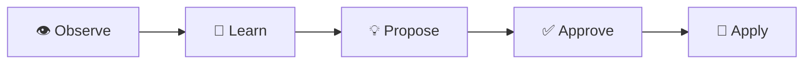
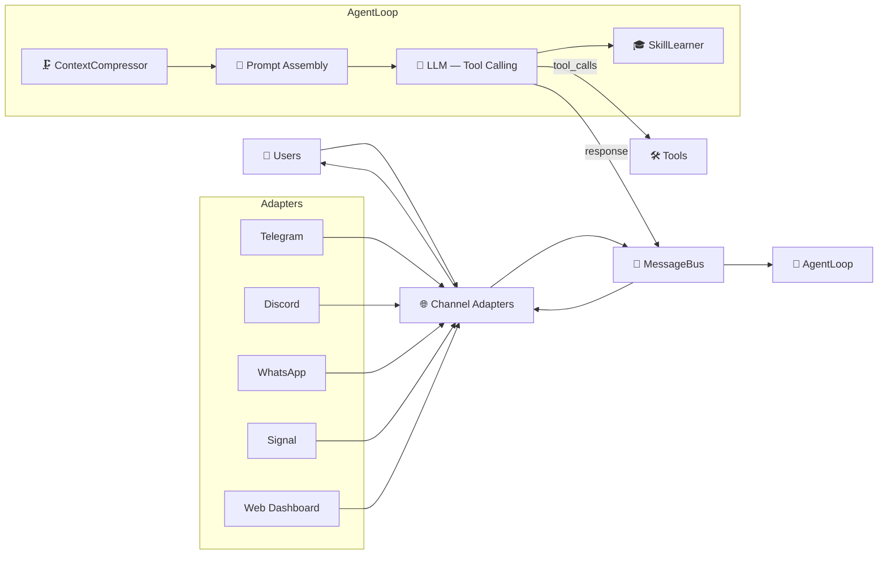

# NewClaw 🪐

> **Language / Idioma:**
> 🇺🇸 **English** | 🇧🇷 [Português](README.pt-br.md) | 🇪🇸 [Español](README.es.md)

[](https://opensource.org/licenses/MIT)
[](https://nodejs.org/)
[](https://github.com/rovanni/NewClaw)
[](https://github.com/rovanni/NewClaw/pulls)

### A local cognitive agent with semantic memory, native tool calling, and a multi-channel interface.


NewClaw is a **local-first cognitive system** built with Node.js and TypeScript. It combines persistent semantic memory, native tool calling, multi-provider fallback, and a web dashboard so the agent can reason over context, use tools structurally, and keep long-term knowledge across interactions.

Instead of acting like a simple reactive bot, NewClaw maintains an evolving world model with identities, preferences, projects, facts, and infrastructure represented as a semantic graph.

Inspired by [Hermes Agent](https://github.com/NousResearch/Hermes-Agent) and [OpenClaw](https://github.com/openclaw/openclaw).

## 🔀 Multi-Channel Architecture
NewClaw features a **MessageBus-driven architecture** that decouples the cognitive core from the communication interfaces. This allows the agent to maintain a single, consistent memory and identity while interacting across multiple platforms simultaneously:

*   **Unified Pipeline**: All messages are normalized into a standard format before reaching the agent.
*   **Persistent Identity**: Whether you talk to NewClaw on Telegram or Discord, it's the same agent with the same evolving memory.
*   **Cross-Platform Commands**: Commands like `/clear` or `/skills` work consistently across all channels.
*   **Media-Ready**: Built-in support for text, voice, photos, and documents across all supported adapters.

## 🧠 Atomic Cognition: Unified Decision Core

The core of NewClaw is its **Atomic Cognition Architecture**. Unlike traditional agents that follow a slow, linear chain of separate validation and critic steps, NewClaw processes all strategic intelligence in a single, unified atomic turn:

1.  **Unified Reasoning**: The agent thinks, decides on an action, and evaluates its own completion status in a single structured JSON response.
2.  **Extreme Efficiency**: Eliminates the latency of multiple sequential LLM calls, typically resolving tasks in just 1 or 2 high-value decision cycles.
3.  **Internal Self-Evaluation**: Confidence scoring and goal validation happen naturally within the model's internal reasoning, rather than through external supervisors.
4.  **Robust & Resilient**: Features advanced JSON parsing with automatic recovery from formatting errors and markdown leaks.
5.  **Clean & Direct**: Prioritizes useful, evidence-based answers over aesthetic perfection or over-execution.

This ensures the agent **"thinks once, but thinks deep,"** providing professional-grade autonomy with minimal latency.

## 🚀 The NewClaw Edge

What sets NewClaw apart is its focus on **Long-Term Cognitive Consistency** and **Structural Reliability**:

*   🛡️ **Local-First & Private**: Your data, memories, and models stay under your control. No third-party data harvesting.
*   🗺️ **Evolving World Model**: Unlike reactive bots that treat every session as new, NewClaw builds a persistent semantic graph of your preferences, projects, and infrastructure.
*   🏗️ **Native Structural Reasoning**: It doesn't "guess" how to use tools through text parsing. It uses native function calling to interact with the world with surgical precision.
*   🔄 **Extreme Resilience**: With a multi-provider fallback chain and an intelligent model router, the system ensures continuity even if a specific model or provider fails.
*   🎓 **Self-Optimizing Skills**: The agent doesn't just perform tasks; it observes patterns in its own execution and proposes new, reusable skills to become more efficient over time.

### 🔄 The Learning Cycle
NewClaw doesn't just store data; it evolves. The system follows a continuous optimization loop:

*Observe patterns → Learn interactions → Propose reusable skills → User approval → Apply in future tasks.*

## ⚙️ Core Operation Modes
The agent operates in four distinct modes depending on the task complexity:
1.  💬 **Respond**: Natural conversation and reasoning using long-term context.
2.  🔍 **Search**: Multi-source synthesis and evidence-based research.
3.  🧭 **Explore**: Active web navigation and deep page interaction.
4.  ⚡ **Execute**: Direct system commands and precise file operations.

## ✨ Features

| Feature | Description |
|---------|-----------|
| 🧠 **Semantic Memory** | SQLite + FTS5 + embeddings, 7 node types, 14+ relationships with advanced curation. |
| 👁️ **Attention Layer** | Contextual prioritization system that re-ranks memory based on feedback. |
| 🔀 **Multi-Channel** | **MessageBus Architecture**: Native support for **Telegram, Discord, WhatsApp, Signal**, and **Web**. |
| 📞 **Native Tool Calling** | Structural function calling (Ollama/Gemini) for precision without fragile text parsing. |
| 🧭 **Model Router** | Intelligent LLM routing to specialized models (Chat, Code, Vision, Analysis, Execution). |
| 🔄 **Provider Fallback** | Multi-provider resilience: Ollama → Gemini → DeepSeek → Groq. |
| ⚖️ **Memory Governance** | Self-regulating memory with confidence decay, conflict resolution, and reversible archiving. |
| 🎓 **SkillLearner** | Autonomous pattern recognition that feeds the **Learning Cycle**. |
| 🌐 **Web Search** | Iterative multi-source research with grounded synthesis and page reading. |
| 🧭 **Active Exploration**| **Exploration Layer**: Terminal-style web navigation for deep site interaction (supports `w3m`). |
| 📊 **Web Dashboard** | Real-time chat, config suite, memory curation, and interactive graph visualization. |
| 📸 **Snapshots** | Graph versioning with create, restore, list, and delete operations. |
| 🖥️ **SSH Exec** | Remote command execution via SSH for multi-server infrastructure management. |
| 🛡️ **Self-Diagnosis Auditor** | Owner-only `/audit` command: code, runtime, data & multi-channel integration checks. |

## 🏗️ Architecture

### Message Flow



### Session System (v2)

NewClaw uses an **event-sourced session architecture** for full conversational continuity:

| Component | Purpose |
|-----------|---------|
| **SessionTranscript** | JSONL append-only log, every event recorded with sequence number and metadata |
| **SessionManager** | Mutex per session, hybrid compression (20 msgs OR 3000 tokens) |
| **SessionContext** | Builds LLM context: system prompt → checkpoint → recent messages → semantic memory |
| **SessionLearner** | Extracts facts from conversations into the cognitive graph |

## 🚀 Setup

### Quick Install (Recommended)

```bash
curl -fsSL https://raw.githubusercontent.com/rovanni/NewClaw/main/install.sh | bash
```

### 🪟 Windows Install

**Quick install (PowerShell — run as Administrator):**

```powershell
irm https://raw.githubusercontent.com/rovanni/NewClaw/main/install.ps1 | iex
```

### CLI Reference

| Command | Description |
|---|---|
| `newclaw start` | Start the agent |
| `newclaw stop` | Gracefully stop the service |
| `newclaw status` | Show health, PID, and uptime |
| `newclaw logs -f` | Tail execution logs |
| `newclaw update` | Pull latest version and rebuild |

---

## 🛡️ Self-Diagnosis Auditor

NewClaw includes a built-in **Self-Diagnosis Agent** that uses the local LLM to analyze its own code and runtime behavior.

> **💡 How to use:** The `/audit` command works on **any channel** (Telegram, Discord, etc.). It is **owner-only**.

| Command | Description | Time |
|---------|-----------|------|
| `/audit` | Full audit (code + runtime + data + integration) | ~1-3 min |
| `/audit fix` | **Auto-fix pipeline** — applies only low-risk, multi-validated fixes | ~1-5 min |

---

## 🗺️ Roadmap
Detailed roadmap can be found in [docs/ROADMAP.md](docs/ROADMAP.md).

## 📄 License
This project is under the MIT license.

---
*NewClaw — The Future of Local Cognitive Agents* 🪐
