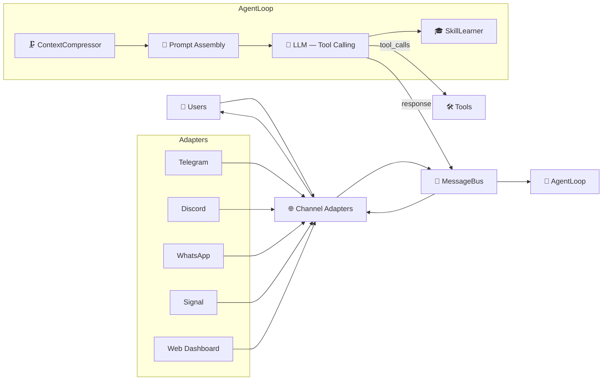

# NewClaw 🪐

> **Language / Idioma:**
> 🇺🇸 **English** | 🇧🇷 [Português](README.pt-br.md) | 🇪🇸 [Español](README.es.md)

[](https://opensource.org/licenses/MIT)
[](https://nodejs.org/)
[](https://github.com/rovanni/NewClaw)
[](https://github.com/rovanni/NewClaw/pulls)

---

> **You:** "My daughter loves math."
>
> *Two days later:*
>
> **You:** "What do you know about my family?"
> **NewClaw:** "Your daughter loves math."
>
> *No fine-tuning. No injected context. No repeating yourself.*

---

## The AI assistant that actually remembers you

Every AI assistant today forgets you the moment the session ends. You repeat yourself constantly. The context you built last week is gone. The AI never grows into knowing who you are.

**NewClaw is different.**

It runs locally on your machine, builds a persistent memory of who you are, and stays with you across Telegram, WhatsApp, and Discord — even after weeks or months. Same agent. Same memory. Always.

---

## See it in action

### Memory that persists across time

```
You: "I'm working on a project called Orion — it's a customer management system."
NewClaw: "Got it. I've added Orion to your known projects."

[One week later]

You: "What projects am I working on?"
NewClaw: "You have Orion — a customer management system you mentioned last week."
```

### Context that shapes future responses

```
You: "I really dislike meetings before 10am."

[Later that week]

You: "Schedule a team meeting for tomorrow."
NewClaw: "I'll suggest times after 10am, since you prefer that."
```

### The same agent, everywhere

You send a voice note on Telegram in the morning. Later you open the web dashboard. Tonight you reply on Discord. It's the same NewClaw — with the same memory and the same context — every time.

---


*Real memory graph — 65 nodes, 167 edges. Labels removed for privacy.*

---

## Quick Install

**Linux/macOS:**
```bash
curl -fsSL https://raw.githubusercontent.com/rovanni/NewClaw/main/install.sh | bash
```

**Windows (PowerShell as Administrator):**
```powershell
irm https://raw.githubusercontent.com/rovanni/NewClaw/main/install.ps1 | iex
```

### Requirements

- Windows 10 (1809+) / Windows 11, or Linux/macOS
- Node.js 22+ (the installer installs it for you if missing)
- 2GB+ RAM, 5GB+ free disk space
- No chat channel is required to get started — NewClaw runs standalone through the local
  Web Dashboard (`http://localhost:3090`). Add Telegram, Discord, WhatsApp or Signal later
  anytime with `newclaw channels enable <channel>`.

### Installation troubleshooting

- **Windows — "cannot be loaded because running scripts is disabled on this system"**: this
  only happens if you downloaded the file and ran `.\install.ps1` directly instead of the
  `irm | iex` one-liner above (which isn't affected by this restriction). Fix it once with:
  ```powershell
  Set-ExecutionPolicy RemoteSigned -Scope CurrentUser
  ```
  This only affects your own user account, not the whole machine, and also prevents the same
  block from hitting `npm` commands later. The installer checks and fixes this automatically
  when it can run.
- **Windows — PM2 fails to connect / the bot doesn't stay running**: usually a leftover PM2
  daemon started under a different privilege level (`EPERM` on the named pipe). Run
  `newclaw doctor` for a full diagnosis, or fall back to `npm start` (no auto-restart, but works).
- **Anytime**: run `newclaw doctor` to check Node, PM2, Ollama, configured channels, disk space,
  and Windows auto-start in one pass.

---

## How NewClaw compares

| Every other assistant | NewClaw |
|---|---|
| Forgets everything after each session | Persistent memory — remembers across days, weeks, months |
| Your data lives on someone else's servers | 100% local-first — your data never leaves your machine |
| One interface (usually just a chat window) | Telegram, WhatsApp, Discord, Signal, Web — one agent |
| Starts from zero every conversation | Builds a world model of you that evolves over time |
| Requires expensive API subscriptions | Runs on local models (Ollama) with cloud as optional fallback |

---

## What you can do with it

- **Ask anything about your history** — preferences, decisions, projects, people you've mentioned
- **Use any channel** — Telegram, WhatsApp, Discord, web dashboard, or all at once
- **Keep your data private** — runs 100% locally, no cloud required
- **Let it learn your patterns** — it proposes shortcuts based on how you actually work
- **Run it on your server** — persistent background service, SSH support, multi-instance

---

## Features

| Feature | What it does for you |
|---|---|
| 🧠 **Semantic Memory** | Remembers people, preferences, projects, facts — and the connections between them |
| 🔀 **Multi-Channel** | Telegram, Discord, WhatsApp, Signal, Web — one agent across all channels |
| 🛡️ **Local-First** | No cloud required. No data harvesting. Runs entirely on your hardware |
| 🎓 **Skill Learning** | Observes how you work and proposes reusable shortcuts over time |
| 🔄 **Provider Fallback** | Ollama → Gemini → DeepSeek → Groq — switches automatically if one fails |
| 📊 **Web Dashboard** | Visual memory graph, real-time chat, full configuration interface — see below |
| 🌐 **Web Search** | Researches topics and synthesizes answers from multiple sources |
| 🖥️ **SSH Exec** | Run commands on remote servers directly from your chat |
| 📸 **Memory Snapshots** | Version your agent's knowledge — create, restore, and compare states |
| 🛡️ **Self-Audit** | The agent inspects and fixes its own runtime using `/audit` |

---


*Web Dashboard — interactive graph visualization with node types: Identity, Preference, Project, Context, Fact, Skill.*

---

## CLI Reference

| Command | Description |
|---|---|
| `newclaw start` | Start the agent |
| `newclaw stop` | Gracefully stop the service |
| `newclaw status` | Show health, PID, and uptime |
| `newclaw logs -f` | Tail execution logs |
| `newclaw update` | Pull latest version and rebuild |
| `newclaw passwd` | Set or change the Dashboard password |
| `newclaw onboard` | Configure providers and API keys |
| `newclaw channels` | Show channel status (Telegram, Discord, WhatsApp, Signal) |
| `newclaw channels enable <name>` | Enable a channel |
| `newclaw channels disable <name>` | Disable a channel |

---

## Self-Diagnosis Auditor

NewClaw can inspect its own code and runtime behavior using the local LLM.

> **Owner-only.** Works on any channel (Telegram, Discord, etc.).

| Command | Description | Time |
|---|---|---|
| `/audit` | Full audit — code, runtime, data, integrations | ~1-3 min |
| `/audit fix` | Auto-fix pipeline — applies only low-risk, validated fixes | ~1-5 min |
| `/cancel` | Cancel the current operation (`/cancelar`, `/stop`, `/pare` also work) | instant |

---

<details>
<summary>⚙️ How it works internally</summary>

### Message Flow



For the full architectural philosophy behind this (why channels never touch AI logic, what's
forbidden to import where, how to add a new channel), see [docs/ARCHITECTURE.md](docs/ARCHITECTURE.md).

### Session System (v2)

| Component | Purpose |
|---|---|
| **SessionTranscript** | JSONL append-only log, every event recorded with sequence number and metadata |
| **SessionManager** | Mutex per session, hybrid compression (20 msgs OR 3000 tokens) |
| **SessionContext** | Builds LLM context: system prompt → checkpoint → recent messages → semantic memory |
| **SessionLearner** | Extracts facts from conversations into the cognitive graph |

### Operation Modes

The agent operates in four modes depending on task complexity:

1. 💬 **Respond** — Natural conversation using long-term context
2. 🔍 **Search** — Multi-source synthesis and evidence-based research
3. 🧭 **Explore** — Active web navigation and deep page interaction
4. ⚡ **Execute** — Direct system commands and file operations

</details>

---

## Roadmap

Detailed roadmap in [docs/ROADMAP.md](docs/ROADMAP.md).

## License

MIT — [opensource.org/licenses/MIT](https://opensource.org/licenses/MIT)

---

*NewClaw — The AI that remembers you.* 🪐
