<a name="inicio"></a>
<a name="english"></a>
**[English Version](#english)** | **[Versão em Português](#português)**
# NewClaw 🪐

A local cognitive agent with semantic memory, native tool calling, and a Telegram interface.


NewClaw is a local-first cognitive system built with Node.js and TypeScript. It combines persistent semantic memory, native tool calling, multi-provider fallback, and a web dashboard so the agent can reason over context, use tools structurally, and keep long-term knowledge across interactions.

Instead of acting like a simple reactive bot, NewClaw maintains an evolving world model with identities, preferences, projects, facts, and infrastructure represented as a semantic graph. That allows the agent to respond with more continuity, make better decisions, and reuse context over time.

Inspired by [Hermes Agent](https://github.com/NousResearch/Hermes-Agent) and [OpenClaw](https://github.com/openclaw/openclaw).

## 🔀 Multi-Channel Architecture
NewClaw features a **MessageBus-driven architecture** that decouples the cognitive core from the communication interfaces. This allows the agent to maintain a single, consistent memory and identity while interacting across multiple platforms simultaneously:

*   **Unified Pipeline**: All messages are normalized into a standard format before reaching the agent.
*   **Persistent Identity**: Whether you talk to NewClaw on Telegram or Discord, it's the same agent with the same evolving memory.
*   **Cross-Platform Commands**: Commands like `/clear` or `/skills` work consistently across all channels.
*   **Media-Ready**: Built-in support for text, voice, photos, and documents across all supported adapters.

## 🧠 Atomic Cognition: Unified Decision Core

The core of NewClaw is its **Atomic Cognition Architecture**. Unlike traditional agents that follow a slow, linear chain of separate validation and critic steps, NewClaw processes all strategic intelligence in a single, unified atomic turn:

1.  **Unified Reasoning**: The agent thinks, decides on an action, and evaluates its own completion status in a single structured JSON response.
2.  **Extreme Efficiency**: Eliminates the latency of multiple sequential LLM calls, typically resolving tasks in just 1 or 2 high-value decision cycles.
3.  **Internal Self-Evaluation**: Confidence scoring and goal validation happen naturally within the model's internal reasoning, rather than through external supervisors.
4.  **Robust & Resilient**: Features advanced JSON parsing with automatic recovery from formatting errors and markdown leaks.
5.  **Clean & Direct**: Prioritizes useful, evidence-based answers over aesthetic perfection or over-execution.

This ensures the agent **"thinks once, but thinks deep,"** providing professional-grade autonomy with minimal latency.

## 🚀 The NewClaw Edge

What sets NewClaw apart is its focus on **Long-Term Cognitive Consistency** and **Structural Reliability**:

*   🛡️ **Local-First & Private**: Your data, memories, and models stay under your control. No third-party data harvesting.
*   🗺️ **Evolving World Model**: Unlike reactive bots that treat every session as new, NewClaw builds a persistent semantic graph of your preferences, projects, and infrastructure.
*   🏗️ **Native Structural Reasoning**: It doesn't "guess" how to use tools through text parsing. It uses native function calling to interact with the world with surgical precision.
*   🔄 **Extreme Resilience**: With a multi-provider fallback chain and an intelligent model router, the system ensures continuity even if a specific model or provider fails.
*   🎓 **Self-Optimizing Skills**: The agent doesn't just perform tasks; it observes patterns in its own execution and proposes new, reusable skills to become more efficient over time.

### 🔄 The Learning Cycle
NewClaw doesn't just store data; it evolves. The system follows a continuous optimization loop:
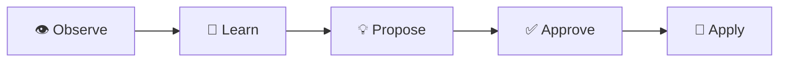
*Observe patterns → Learn interactions → Propose reusable skills → User approval → Apply in future tasks.*

## ⚙️ Core Operation Modes
The agent operates in four distinct modes depending on the task complexity:
1.  💬 **Respond**: Natural conversation and reasoning using long-term context.
2.  🔍 **Search**: Multi-source synthesis and evidence-based research.
3.  🧭 **Explore**: Active web navigation and deep page interaction.
4.  ⚡ **Execute**: Direct system commands and precise file operations.

## ✨ Features

| Feature | Description |
|---------|-----------|
| 🧠 **Semantic Memory** | SQLite + FTS5 + embeddings, 7 node types, 14+ relationships with advanced curation (merge/delete). |
| 👁️ **Attention Layer** | Contextual prioritization system that re-ranks memory based on current interaction and feedback. |
| 🔀 **Multi-Channel** | **MessageBus Architecture**: Native support for **Telegram, Discord, WhatsApp, Signal**, and **Web**. |
| 📞 **Native Tool Calling** | Structural function calling (Ollama/Gemini) for precision without fragile text parsing. |
| 🧭 **Model Router** | Intelligent LLM routing to specialized models (Chat, Code, Vision, Analysis, Execution) with failover. |
| 🔄 **Provider Fallback** | Multi-provider resilience: Ollama → Gemini → DeepSeek → Groq. |
| ⚖️ **Memory Governance** | Self-regulating memory with confidence decay, conflict resolution, and reversible archiving. |
| 🎓 **SkillLearner** | Autonomous pattern recognition that feeds the **Learning Cycle** for user-approved efficiency. |
| 🌐 **Web Search** | Iterative multi-source research with grounded synthesis and page reading. |
| 🧭 **Active Exploration**| **Exploration Layer**: Terminal-style web navigation for deep site interaction (supports `w3m`). |
| 📊 **Web Dashboard** | Real-time chat, config suite, memory curation, and interactive graph visualization. |
| 📸 **Snapshots** | Graph versioning with create, restore, list, and delete operations. |
| 🔗 **Thorial Graph Sync** | Shared cognitive memory between Thorial (OpenClaw) and NewClaw via `thorial_graph` tool. |
| 🖥️ **SSH Exec** | Remote command execution via SSH for multi-server infrastructure management. |
| 📄 **Document Sharing** | Send files and documents directly through Telegram with `send_document` tool. |
| 🔊 **Whisper Fallback Chain** | Multi-tier STT with automatic GPU → CPU fallback (`WHISPER_API_URL` + `WHISPER_API_FALLBACK`). |
| 📊 **Crypto Analysis** | Real-time cryptocurrency analysis and report generation tools. |
| ⚙️ **Server Config** | Self-hosted friendly configuration management tool. |
| 🧩 **Skill Installer** | Dynamic skill installation and loading for extensible agent capabilities. |
| 👋 **Onboarding Service** | Guided setup for new users with interactive configuration. |
| 🛡️ **Self-Diagnosis Auditor** | Owner-only `/audit` command: code, runtime, data & multi-channel integration checks. Auto-fix pipeline with multi-agent validation and consensus-based patching. |

## 🏗️ Architecture

### Message Flow


### Tool Calling Flow

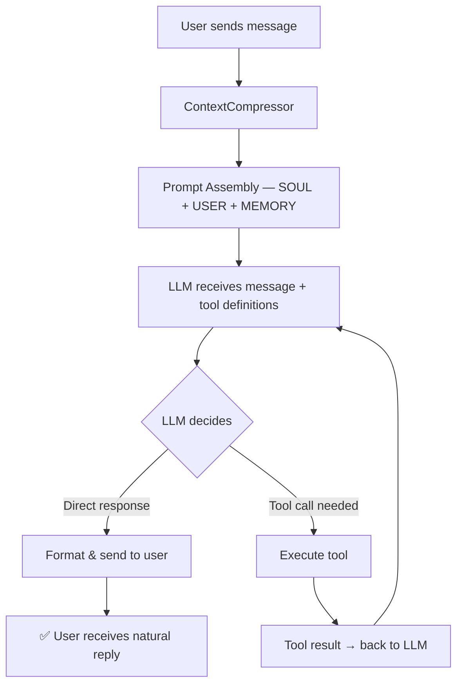

### Provider Fallback Chain

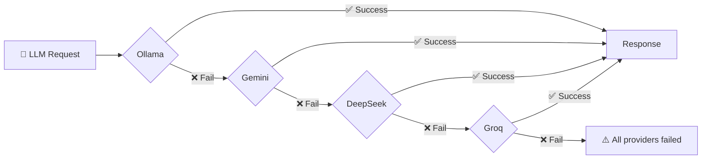

### Model Router — Intelligent Model Selection

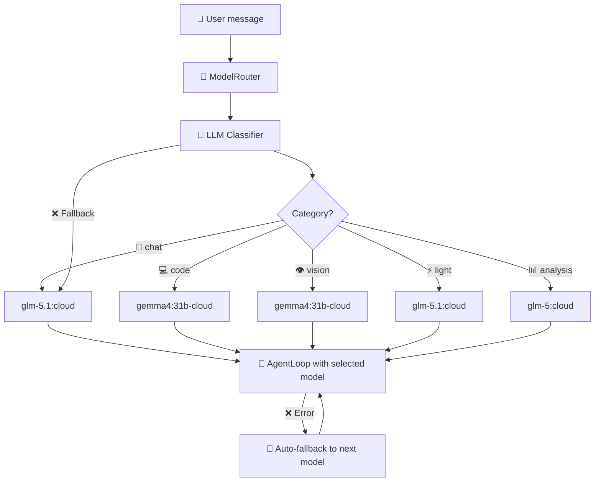

The ModelRouter uses a lightweight LLM to classify each user message into one of 5 categories, then selects the best model for that task type. If the classifier fails, deterministic keyword matching is used as fallback. On model error, it automatically falls back to the next available model.

**Categories & Models:**

| Category | Use Case | Model |
|----------|----------|-------|
| 💬 chat | General conversation, reasoning | glm-5.1:cloud |
| 💻 code | Programming, file editing, scripts | gemma4:31b-cloud |
| 👁️ vision | Image analysis, OCR, screenshots | gemma4:31b-cloud |
| ⚡ light | Short responses (hi, ok, thanks) | glm-5.1:cloud |
| 📊 analysis | Crypto, market data, statistics | glm-5:cloud |
| 🧠 execution | Complex tool loops and multi-step reasoning | kimi-k2.6:cloud |

### Semantic Memory Graph

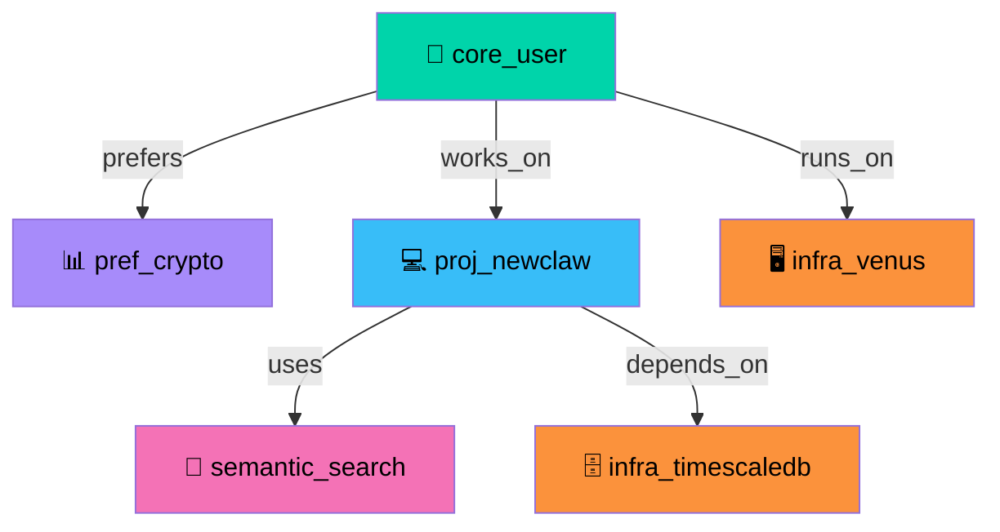

**7 Node Types:** identity, preference, project, skill, context, fact, infrastructure.

**14+ Relationship Types:** prefers, works_on, runs_on, uses, depends_on, contains, references, related_to, belongs_to, owns, created, reads, writes, hosts, plus automatic inverse links.

### Advanced Memory Subsystems

| Module | Description |
|--------|------------|
| 🧠 **AttentionFeedback v2** | Logarithmic saturation scoring (cap 5.0), co-usage validation, and decay engine. Prevents over-reinforcement of popular memories. |
| 🎯 **AttentionLayer** | Priority-weighted attention allocation across cognitive domains with configurable decay rates. |
| 🏷️ **ClassificationMemory** | Categorical memory organization with automatic tagging and domain assignment. |
| 🔀 **CognitiveDomains** | Pluggable domain definitions (trading, infrastructure, academic, personal) for context-aware routing. |
| 📋 **DecisionMemory** | Records agent decisions with confidence scoring and outcome tracking for self-improvement. |
| 📊 **MemoryScoringEngine** | Multi-factor relevance scoring (recency, frequency, domain, attention) for precise retrieval. |
| 🔄 **MemoryReconciliationEngine** | Detects and resolves duplicate/contradictory memories via merge or flag strategies. |
| 🔬 **GraphAnalytics** | Structural analysis of the semantic graph: centrality, connectivity, orphan detection. |
| 🕸️ **LouvainDetector** | Community detection using the Louvain algorithm for automatic cluster identification. |
| 🧹 **MemoryCurator** | Automated curation: merge similar nodes, delete stale entries, enforce cardinality constraints. |

### Session System (v2)

NewClaw uses an **event-sourced session architecture** for full conversational continuity:

```
data/sessions/
├── telegram:USER_ID.jsonl     # Append-only transcript (source of truth)
└── telegram:USER_ID.idx.json  # Seek index for fast replay
```

| Component | Purpose |
|-----------|---------|
| **SessionTranscript** | JSONL append-only log, every event recorded with sequence number and metadata |
| **SessionManager** | Mutex per session, hybrid compression (20 msgs OR 3000 tokens), checkpoint as structured system role |
| **SessionContext** | Builds LLM context: system prompt → checkpoint → recent messages → semantic memory |
| **SessionLearner** | Extracts facts from conversations into the cognitive graph (names, preferences, projects, skills) |
| **EventRanker** | Scores events by importance (role weight, recency, question/decision detection) |

**Token Estimation:** pt-BR aware — 3.5 chars/token for text, 3 chars/token for code/JSON.

**Compaction:** `compactSession()` physically rewrites JSONL (checkpoint + recent events), with `.bak` backup.

**`/clear` command:** Creates a new session (preserves old transcript).

### Memory Governance

NewClaw's memory is **self-regulating** — it learns AND unlearns:

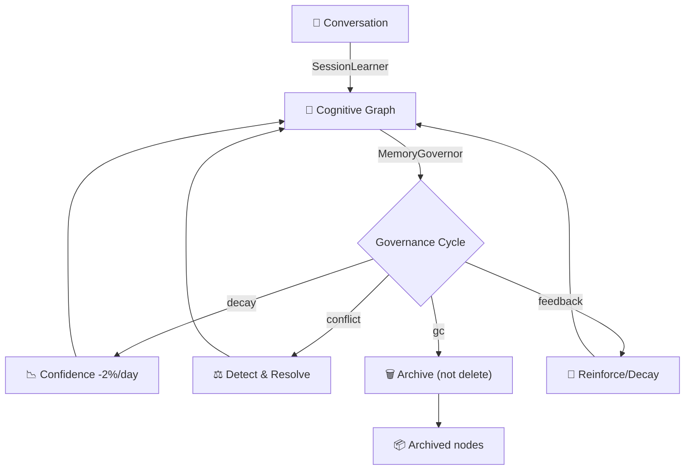

| Mechanism | Rule |
|-----------|------|
| **Confidence Decay** | 2%/day (inferred facts decay 5% faster). Protected nodes never decay. |
| **Conflict Detection** | Contradictions (same domain, different values), duplicates (>85% Jaccard similarity) |
| **Conflict Classification** | `coexist` (both explicit), `replace` (explicit beats inferred), `uncertain` (reduce both) |
| **Garbage Collection** | Archive instead of delete. `metadata.archived=true`, `original_type` preserved for recovery. |
| **Anti-Reinforcement Loop** | Confidence ceiling at 0.95. Diminishing returns: each boost gives 75% of previous (0.75^n). |
| **Usage Feedback** | Helpful facts: +0.05 confidence. Unhelpful: -0.02. Weighted by access count. |
| **Source Classification** | `explicit` (user stated directly) → strong. `inferred` (extracted) → decays faster. |
| **Protected Nodes** | `core_user`, `user_identity`, and all `identity` type nodes never decay or get GC'd. |

**Governance cycle** runs automatically on boot + every 24 hours.

#### Archived Memory Recovery

Archived nodes can be revived if the same fact appears again:

```typescript
// Automatic revival in SessionLearner
if (existingNode.metadata?.archived === 'true') {
    // Revive: restore original type, boost confidence
    memory.addNode({
        ...existingNode,
        type: existingNode.metadata.original_type,
        confidence: Math.min(0.95, (existingNode.confidence || 0.1) + 0.2),
        metadata: { ...existingNode.metadata, archived: undefined }
    });
}
```

> **Result:** Memory with reversible forgetting — old knowledge can come back when relevant again.

## 🚀 Setup

### Install Flow

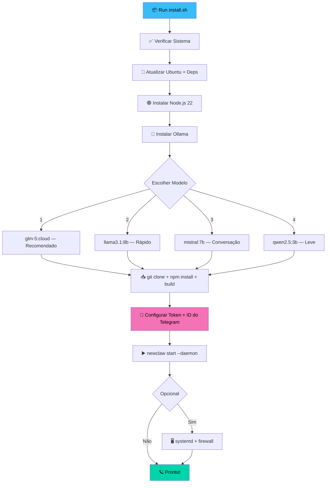

### Quick Install (Recommended)

```bash
curl -fsSL https://raw.githubusercontent.com/rovanni/NewClaw/main/install.sh | bash
```

### Manual Install

```bash
git clone https://github.com/rovanni/NewClaw.git
cd NewClaw
npm install
cp .env.example .env
# Edit .env with your Telegram Token, User ID and OLLAMA_MODEL
npm run build
newclaw start --daemon
```

### 🪟 Windows Install

**Quick install (PowerShell — run as Administrator):**

```powershell
irm https://raw.githubusercontent.com/rovanni/NewClaw/main/install.ps1 | iex
```

**Options:**

```powershell
# With pre-set credentials
.\install.ps1 -Token "YOUR_TOKEN" -UserId "YOUR_ID" -NoPrompt

# Dry run (simulate without changes)
.\install.ps1 -DryRun

# Specific model
.\install.ps1 -Model "llama3.1:8b"

# Skip Windows service creation
.\install.ps1 -NoService
```

**What it does:**
- Verifies system (RAM, disk, internet)
- Installs Node.js 22 LTS via `winget`
- Installs Git via `winget`
- Installs and starts Ollama
- Downloads your chosen AI model
- Clones the repo and builds
- Configures `.env` interactively
- Optionally creates a Windows Service for auto-start
- Optionally opens firewall port

> **Requirements:** Windows 10 1809+ or Windows 11. Run PowerShell as Administrator for service/firewall features.

### Optional Dependency: `w3m`

`web_navigate` works in two modes:
- **With `w3m` installed:** Real terminal-style page rendering for stronger step-by-step navigation.
- **Without `w3m`:** Automatic HTML fallback with readable text extraction and link discovery.

Ubuntu/Debian users get the best navigation experience because the installer adds `w3m` automatically.

## 🛠️ Tool Reference

| Tool | Description |
|------|-------------|
| `web_search` | Multi-source iterative web research with synthesis |
| `web_navigate` | Terminal-style web page navigation and deep interaction |
| `memory_search` | Semantic search across the memory graph |
| `memory_write` | Create/update nodes and relationships in the memory graph |
| `manage_memory` | Curate, merge, and delete memory nodes |
| `memory_admin` | Advanced admin: snapshots, statistics, bulk operations |
| `exec_command` | Execute system commands locally with timeout and output capture |
| `ssh_exec` | Execute commands on remote servers via SSH |
| `file_ops` | Read, write, search, and manage files on the filesystem |
| `send_audio` | Generate and send voice messages via Edge-TTS + Telegram |
| `send_document` | Send files and documents through Telegram |
| `api_request` | Make HTTP requests to external APIs |
| `crypto_analysis` | Real-time cryptocurrency market analysis |
| `crypto_report` | Generate formatted crypto market reports |
| `thorial_graph` | Sync cognitive memory with Thorial (OpenClaw) shared graph |
| `server_config` | Manage server configuration for self-hosted deployments |

## 🛡️ Self-Diagnosis Auditor

NewClaw includes a built-in **Self-Diagnosis Agent** that uses the local LLM to analyze its own code, runtime behavior, and integration health.

### Commands (Owner-Only)

| Command | Description |
|---------|-------------|
| `/audit` | Full audit (code + runtime + data + integration) |
| `/audit code` | Source code analysis via LLM |
| `/audit runtime` | Log analysis + static pattern detection |
| `/audit data` | SQLite consistency validation |
| `/audit integration` | Multi-channel health check (Telegram, Discord, WhatsApp, Signal, Web, Ollama) |
| `/audit history` | Last 10 audit reports |
| `/audit fix` | **Auto-fix pipeline** — only applies low-risk, multi-validated fixes |

### Auto-Fix Pipeline

```
/audit fix
  │
  ├── 1. SELECT findings WHERE auto_fixable=1 AND fixed=0 AND risk_level='low'
  │
  ├── 2. generatePatch(finding)      → LLM generates before/after with confidence
  │
  ├── 3. validatePatch(patch)         → 3 agents review: code_reviewer, bug_detector, safety_checker
  │
  ├── 4. buildConsensus(opinions)     → agreement ≥ 0.75 AND confidence ≥ 0.8
  │
  ├── 5. validatePatchSafety(patch)   → Deterministic: file exists, before found, size ok, no destructive patterns
  │
  ├── 6. applyPatch(patch)            → Backup .bak → replace → restore on error
  │
  └── 7. markFindingFixed(id)          → UPDATE audit_findings SET fixed = 1
```

**Safety rules:**
- Only `risk_level = 'low'` findings enter the pipeline
- LLM confidence < 0.5 → rejected at generation
- Consensus < 0.75 → rejected
- File doesn't exist / `before` not found → rejected
- Destructive patterns (eval, rm -rf, removing imports) → rejected
- Any error → automatic .bak restore

### Multi-Channel Integration Check

`/audit integration` verifies all 5 channels:

| Channel | Check |
|---------|-------|
| 🟦 Telegram | Bot token validation via `getMe` API |
| 🟣 Discord | Bot token validation via `/users/@me` API |
| 🟢 WhatsApp | Auth directory exists (QR scan required) |
| 🔵 Signal | `signal-cli` binary availability |
| 🟡 Web Dashboard | HTTP response on configured port |
| 🤖 Ollama | Model availability via `/api/tags` |
| 💽 System | Disk usage, Node.js version, process health |

**Completed in v1.x:**
- [x] **Model Router**: Intelligent intent-based model selection ✅
- [x] **Atomic Cognition**: Unified decision cycle (THINK → DECIDE → ACT) ✅
- [x] **Thorial Graph Sync**: Shared cognitive memory with OpenClaw/Thorial ✅
- [x] **SSH Exec**: Remote infrastructure management ✅
- [x] **Advanced Memory**: Attention feedback, scoring, reconciliation, Louvain clustering ✅
- [x] **Whisper Fallback Chain**: Multi-tier STT with GPU→CPU failover ✅
- [x] **Crypto Analysis**: Real-time market analysis and reports ✅

**Upcoming:**
- [ ] **Multimodal Vision**: Native image and screenshot processing
- [ ] **Autonomous Navigation**: Real-time web exploration with deep interaction
- [ ] **Python Sandbox**: Secure execution environment for data analysis
- [ ] **Collaborative Graphs**: Multi-agent memory synchronization


---

## 📱 CLI Reference

| Command | Description |
|---|---|
| `newclaw start` | Start the agent (foreground) |
| `newclaw start --daemon` | Run in background (VPS mode) |
| `newclaw stop` | Gracefully stop the service |
| `newclaw status` | Show health, PID, and uptime |
| `newclaw logs -f` | Tail execution logs |
| `newclaw update` | Pull latest version and rebuild |

### 🗑️ Uninstall

The uninstaller backs up your data (database, workspace, skills) before removing.

**Linux/macOS:**

```bash
./uninstall.sh                   # Interactive (recommended)
./uninstall.sh --backup-only     # Just create a backup
./uninstall.sh --keep-data       # Remove code, keep data
```

**Windows (PowerShell):**

```powershell
.\uninstall.ps1                  # Interactive (recommended)
.\uninstall.ps1 -BackupOnly      # Just create a backup
.\uninstall.ps1 -KeepData        # Remove code, keep data
```

Backups are saved to `~/newclaw-backups/` with a timestamp.

---
<a name="português"></a>
# 🇧🇷 Versão em Português

# NewClaw Cognitive System v1.0 🪐

### Agente cognitivo autônomo com tool-calling nativo, grafo de memória semântica e fallback multi-provider.


O NewClaw é um **Agente Cognitivo Avançado** (100% local e privado), desenvolvido em Node.js (TypeScript). Ele é especializado na execução autônoma de tarefas através de chamadas de ferramentas nativas e gerenciamento de memória semântica de longo prazo.

## 🔀 Arquitetura Multi-Canal
O NewClaw possui uma **arquitetura baseada em MessageBus** que desacopla o núcleo cognitivo das interfaces de comunicação. Isso permite que o agente mantenha uma única memória e identidade consistente enquanto interage em múltiplas plataformas simultaneamente:

*   **Pipeline Unificado**: Todas as mensagens são normalizadas antes de chegarem ao agente.
*   **Identidade Persistente**: O agente é o mesmo no Telegram, Discord ou qualquer outro canal.
*   **Comandos Multi-Plataforma**: Comandos como `/clear` ou `/skills` funcionam em todos os canais.
*   **Suporte a Mídia**: Processamento nativo de texto, voz, fotos e documentos em todos os adaptadores.

## 🧠 Cognição Atômica: Núcleo de Decisão Unificado

O diferencial do NewClaw é a sua **Arquitetura de Cognição Atômica**. Diferente de agentes tradicionais que seguem uma cadeia lenta e linear de etapas separadas, o NewClaw processa toda a inteligência estratégica em um único turno atômico unificado:

1.  **Raciocínio Unificado**: O agente pensa, decide a ação e avalia sua própria completude em uma única resposta JSON estruturada.
2.  **Eficiência Extrema**: Elimina a latência de múltiplas chamadas LLM sequenciais, resolvendo tarefas em apenas 1 ou 2 ciclos de decisão de alto valor.
3.  **Auto-Avaliação Nativa**: O cálculo de confiança e a validação de objetivos acontecem naturalmente dentro do raciocínio interno do modelo, sem supervisores externos.
4.  **Robusto e Resiliente**: Possui parsing avançado de JSON com recuperação automática de erros de formatação e vazamentos de markdown.
5.  **Limpo e Direto**: Prioriza respostas úteis e baseadas em evidências sobre perfeccionismo estético ou execução excessiva.

Isso garante que o agente **"pense uma vez, mas pense profundo"**, oferecendo autonomia de nível profissional com o mínimo de latência.

## 🚀 O Diferencial NewClaw

O que torna o NewClaw único é o seu foco em **Consistência Cognitiva de Longo Prazo** e **Confiabilidade Estrutural**:

*   🛡️ **Privacidade Local-First**: Seus dados, memórias e modelos permanecem sob seu controle total, sem coleta de dados por terceiros.
*   🗺️ **Modelo de Mundo Evolutivo**: Diferente de bots reativos, o NewClaw constrói um grafo semântico persistente de suas preferências, projetos e infraestrutura.
*   🏗️ **Raciocínio Estrutural Nativo**: O agente não "adivinha" como usar ferramentas via texto; ele utiliza chamadas de função nativas para interagir com o sistema com precisão cirúrgica.
*   🔄 **Resiliência Extrema**: Com uma cadeia de fallback multi-provider e roteamento inteligente, o sistema garante continuidade mesmo se um provedor ou modelo falhar.
*   🎓 **Auto-Otimização de Skills**: O agente observa padrões em sua própria execução e propõe novas habilidades reutilizáveis para se tornar mais eficiente com o tempo.

### 🔄 Ciclo de Aprendizado
O NewClaw não apenas armazena dados; ele evolui. O sistema segue um loop contínuo de otimização:

*Observar padrões → Aprender interações → Propor skills → Aprovação do usuário → Aplicar no futuro.*

## ⚙️ Modos de Operação
O agente atua em quatro modos distintos dependendo da complexidade da tarefa:
1.  💬 **Responder**: Conversa natural e raciocínio usando contexto de longo prazo.
2.  🔍 **Buscar**: Síntese multi-fonte e pesquisa baseada em evidências.
3.  🧭 **Explorar**: Navegação web ativa e interação profunda com páginas.
4.  ⚡ **Executar**: Comandos diretos no sistema e operações de arquivo precisas.

## ✨ Funcionalidades

| Feature | Descrição |
|---------|-----------|
| 🧠 **Memória Semântica** | SQLite + FTS5 + embeddings, 7 tipos de nó, 14+ relações e curadoria avançada (mesclagem/deleção). |
| 👁️ **Camada de Atenção** | Sistema de priorização contextual que reclassifica a memória com base na interação e feedback. |
| 🔀 **Multi-Canal** | **Arquitetura MessageBus**: Suporte nativo a **Telegram, Discord, WhatsApp, Signal** e **Web**. |
| 📞 **Tool Calling Nativo** | Chamada estrutural (Ollama/Gemini) para precisão absoluta sem parsing de texto. |
| 🧭 **Model Router** | Roteamento inteligente para modelos especializados (Chat, Code, Vision, Analysis, Execution). |
| 🔄 **Provider Fallback** | Resiliência multi-provider: Ollama → Gemini → DeepSeek → Groq. |
| ⚖️ **Governança de Memória**| Memória auto-regulada com decaimento de confiança, resolução de conflitos e arquivamento reversível. |
| 🎓 **SkillLearner** | Reconhecimento de padrões que alimenta o **Ciclo de Aprendizado**. |
| 🌐 **Busca Web** | Pesquisa iterativa multi-fonte com síntese e leitura de páginas. |
| 🧭 **Exploração Ativa** | **Camada de Exploração**: Navegação web em modo terminal para interação profunda (suporte a `w3m`). |
| 📊 **Dashboard Web** | Chat em tempo real, config, curadoria de memória e grafo interativo. |
| 📸 **Snapshots** | Versionamento do grafo: criar, restaurar, listar e deletar snapshots. |
| 🔗 **Thorial Graph Sync** | Memória cognitiva compartilhada entre Thorial (OpenClaw) e NewClaw via ferramenta `thorial_graph`. |
| 🖥️ **SSH Exec** | Execução remota de comandos via SSH para gerenciamento de infraestrutura multi-servidor. |
| 📄 **Envio de Documentos** | Envio de arquivos e documentos diretamente pelo Telegram com `send_document`. |
| 🔊 **Whisper Fallback Chain** | STT multi-camada com failover automático GPU → CPU (`WHISPER_API_URL` + `WHISPER_API_FALLBACK`). |
| 📊 **Crypto Analysis** | Análise de criptomoedas em tempo real e geração de relatórios. |
| ⚙️ **Server Config** | Gerenciamento de configuração para deployments self-hosted. |
| 🧩 **Skill Installer** | Instalação e carregamento dinâmico de skills para capacidades extensíveis. |
| 👋 **Onboarding Service** | Setup guiado para novos usuários com configuração interativa. |
| 🛡️ **Auditor de Auto-Diagnóstico** | Comando `/audit` (owner-only): verifica código, runtime, dados e integração multi-canal. Pipeline de correção automática com validação multi-agente e consenso. |

## 🏗️ Arquitetura

### Message Flow

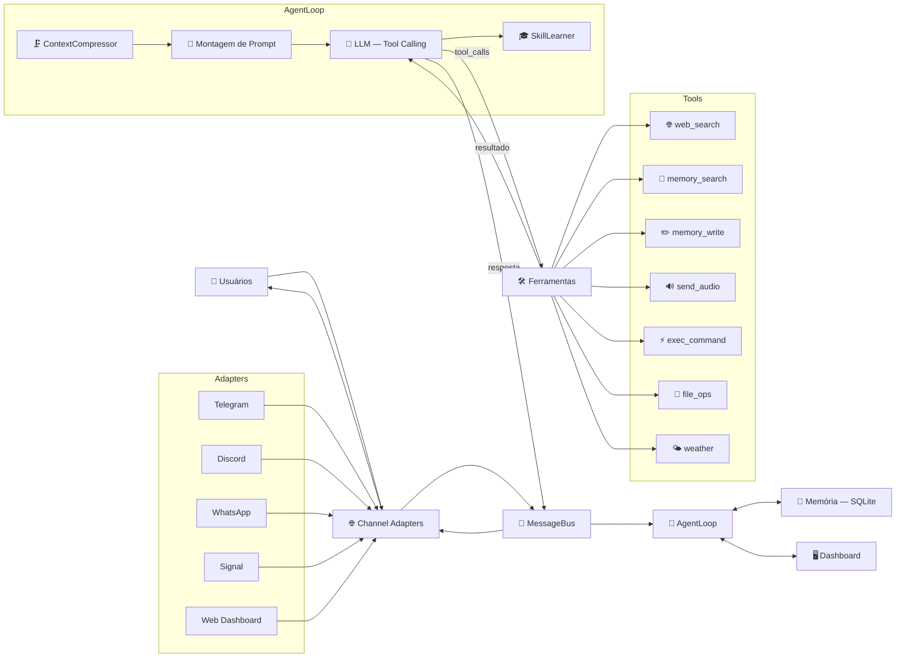

### Fluxo de Chamada de Ferramentas (Tool Calling)

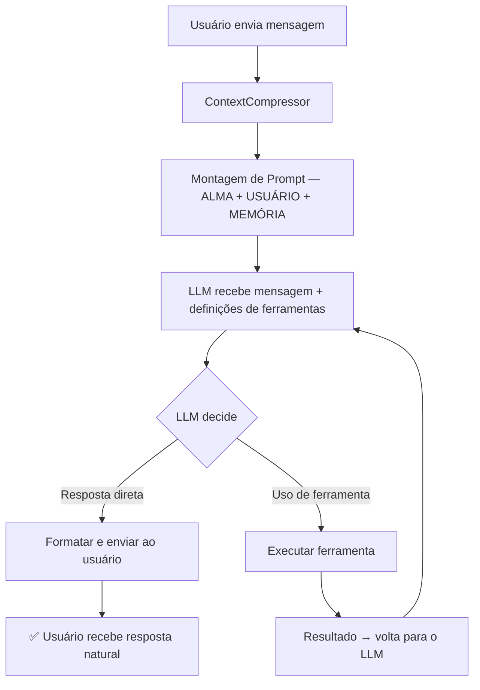

### Cadeia de Fallback de Provedores

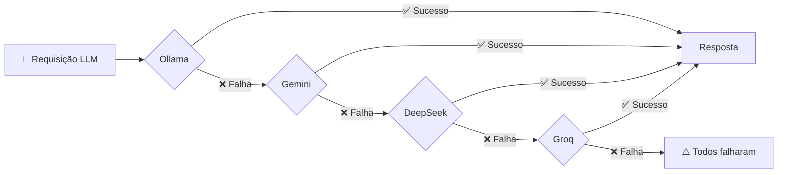

### Model Router — Roteamento Inteligente de Modelos

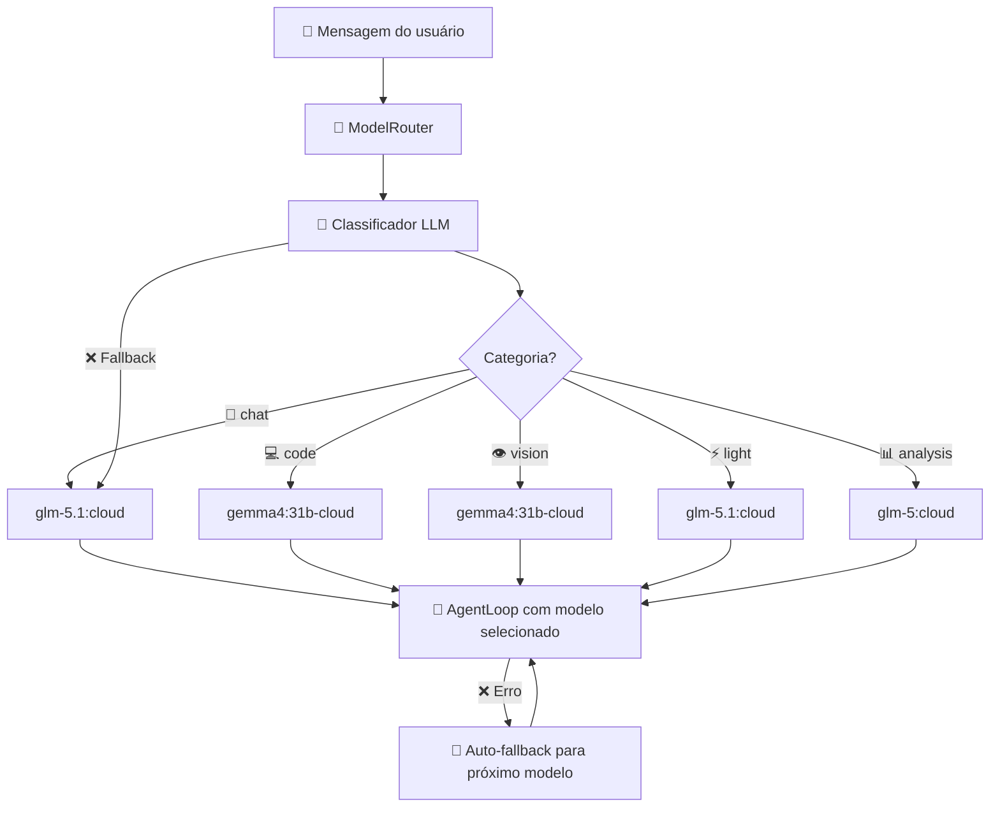

O ModelRouter usa um LLM leve para classificar cada mensagem em 5 categorias e selecionar o melhor modelo para a tarefa. Se o classificador falhar, usa busca por palavras-chave. Em caso de erro no modelo selecionado, ele tenta automaticamente o próximo da lista de fallback.

| Categoria | Caso de Uso | Modelo Recomendado |
|----------|----------|-------|
| 💬 **chat** | Conversa geral, raciocínio | `glm-5.1:cloud` |
| 💻 **code** | Programação, edição de arquivos, scripts | `gemma4:31b-cloud` |
| 👁️ **vision** | Análise de imagens, OCR, screenshots | `gemma4:31b-cloud` |
| ⚡ **light** | Respostas curtas (oi, ok, valeu) | `glm-5.1:cloud` |
| 📊 **analysis** | Cripto, dados de mercado, estatísticas | `glm-5:cloud` |
| 🧠 **execution** | Loops complexos de ferramentas e raciocínio multi-etapa | `kimi-k2.6:cloud` |

### Sistema de Sessões (v2)

O NewClaw utiliza uma **arquitetura de sessão baseada em eventos** para garantir continuidade total na conversa:

```
data/sessions/
├── telegram:ID_USUARIO.jsonl     # Log append-only (fonte da verdade)
└── telegram:ID_USUARIO.idx.json  # Índice de busca para replay rápido
```

| Componente | Propósito |
|-----------|---------|
| **SessionTranscript** | Log JSONL append-only, cada evento gravado com número de sequência e metadados |
| **SessionManager** | Mutex por sessão, compressão híbrida (20 msgs OU 3000 tokens), checkpoint como papel de sistema |
| **SessionContext** | Constrói o contexto LLM: prompt de sistema → checkpoint → mensagens recentes → memória semântica |
| **SessionLearner** | Extrai fatos das conversas para o grafo cognitivo (nomes, preferências, projetos, skills) |
| **EventRanker** | Pontua eventos por importância (peso da role, recência, detecção de pergunta/decisão) |

**Estimativa de Tokens:** pt-BR aware — 3.5 chars/token para texto, 3 chars/token para código/JSON.

**Compactação:** `compactSession()` reescreve fisicamente o JSONL (checkpoint + eventos recentes), com backup `.bak`.

**Comando `/clear`:** Cria uma nova sessão (preserva o transcript antigo).

### Grafo de Memória Semântica


**7 Tipos de Nó:** identity, preference, project, skill, context, fact, infrastructure.

**14+ Tipos de Relação:** prefers, works_on, runs_on, uses, depends_on, contains, references, related_to, belongs_to, owns, created, reads, writes, hosts (com links inversos automáticos).

### Subsistemas de Memória Avançada

| Módulo | Descrição |
|--------|-----------|
| 🧠 **AttentionFeedback v2** | Scoring com saturação logarítmica (cap 5.0), validação de co-uso e motor de decaimento. Previne sobre-reforço de memórias populares. |
| 🎯 **AttentionLayer** | Alocação de atenção ponderada por prioridade entre domínios cognitivos com taxas de decaimento configuráveis. |
| 🏷️ **ClassificationMemory** | Organização categórica de memórias com tagging automático e atribuição de domínio. |
| 🔀 **CognitiveDomains** | Domínios plugáveis (trading, infraestrutura, acadêmico, pessoal) para roteamento context-aware. |
| 📋 **DecisionMemory** | Registra decisões do agente com scoring de confiança e rastreamento de resultados para auto-melhoria. |
| 📊 **MemoryScoringEngine** | Scoring de relevância multifator (recência, frequência, domínio, atenção) para recuperação precisa. |
| 🔄 **MemoryReconciliationEngine** | Detecta e resolve memórias duplicadas/contraditórias via estratégias de merge ou flag. |
| 🔬 **GraphAnalytics** | Análise estrutural do grafo semântico: centralidade, conectividade, detecção de órfãos. |
| 🕸️ **LouvainDetector** | Detecção de comunidades usando o algoritmo Louvain para identificação automática de clusters. |
| 🧹 **MemoryCurator** | Curadoria automatizada: mesclar nós similares, deletar entradas obsoletas, impor restrições de cardinalidade. |

## 🚀 Instalação

### Fluxo de Instalação

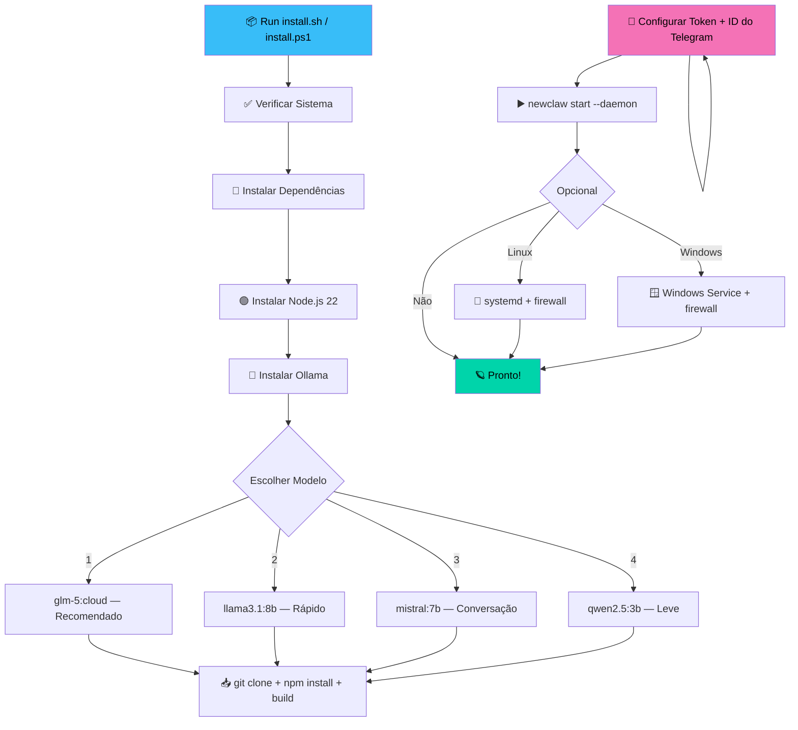

### Instalação Rápida — Linux/macOS (Recomendado)

```bash
curl -fsSL https://raw.githubusercontent.com/rovanni/NewClaw/main/install.sh | bash
```

### Instalação Rápida — Windows 🪟

**Execute o PowerShell como Administrador:**

```powershell
irm https://raw.githubusercontent.com/rovanni/NewClaw/main/install.ps1 | iex
```

**Opções PowerShell:**

```powershell
# Com credenciais pré-definidas
.\install.ps1 -Token "SEU_TOKEN" -UserId "SEU_ID" -NoPrompt

# Dry run (simular sem executar)
.\install.ps1 -DryRun

# Modelo específico
.\install.ps1 -Model "llama3.1:8b"
```

> **Requisitos Windows:** Windows 10 1809+ ou Windows 11. Execute como Administrador para criar serviço e configurar firewall.

### Comandos CLI

| Comando | Descrição |
|---|---|
| `newclaw start` | Inicia o agente |
| `newclaw start --daemon` | Execução em segundo plano (VPS) |
| `newclaw stop` | Encerra o serviço graciosamente |
| `newclaw status` | Health check e uptime |
| `newclaw logs -f` | Logs em tempo real |
| `newclaw update` | Atualiza e recompila o projeto |

### 🗑️ Desinstalação

O desinstalador faz backup dos seus dados (banco, workspace, skills) antes de remover.

**Linux/macOS:**

```bash
./uninstall.sh                   # Interativo (recomendado)
./uninstall.sh --backup-only     # Apenas criar backup
./uninstall.sh --keep-data       # Remover código, manter dados
```

**Windows (PowerShell):**

```powershell
.\uninstall.ps1                  # Interativo (recomendado)
.\uninstall.ps1 -BackupOnly      # Apenas criar backup
.\uninstall.ps1 -KeepData        # Remover código, manter dados
```

Backups são salvos em `~/newclaw-backups/` com timestamp.

---

## 🛠️ Referência de Ferramentas

| Ferramenta | Descrição |
|-----------|-------------|
| `web_search` | Pesquisa web iterativa multi-fonte com síntese |
| `web_navigate` | Navegação web em modo terminal com interação profunda |
| `memory_search` | Busca semântica no grafo de memória |
| `memory_write` | Criar/atualizar nós e relacionamentos no grafo |
| `manage_memory` | Curar, mesclar e deletar nós de memória |
| `memory_admin` | Admin: snapshots, estatísticas, operações em lote |
| `exec_command` | Executar comandos do sistema localmente |
| `ssh_exec` | Executar comandos em servidores remotos via SSH |
| `file_ops` | Ler, escrever, buscar e gerenciar arquivos |
| `send_audio` | Gerar e enviar mensagens de voz via Edge-TTS + Telegram |
| `send_document` | Enviar arquivos e documentos pelo Telegram |
| `api_request` | Fazer requisições HTTP para APIs externas |
| `crypto_analysis` | Análise de mercado cripto em tempo real |
| `crypto_report` | Gerar relatórios formatados do mercado cripto |
| `thorial_graph` | Sincronizar memória cognitiva com grafo compartilhado Thorial/OpenClaw |
| `server_config` | Gerenciar configuração do servidor para deployments self-hosted |

## 🛡️ Auditor de Auto-Diagnóstico

O NewClaw inclui um **Agente de Auto-Diagnóstico** que usa o LLM local para analisar seu próprio código, comportamento em runtime e saúde das integrações.

### Comandos (Owner-Only)

| Comando | Descrição |
|---------|-------------|
| `/audit` | Auditoria completa (código + runtime + dados + integração) |
| `/audit code` | Análise de código fonte via LLM |
| `/audit runtime` | Análise de logs + detecção de padrões estáticos |
| `/audit data` | Validação de consistência do SQLite |
| `/audit integration` | Verificação multi-canal (Telegram, Discord, WhatsApp, Signal, Web, Ollama) |
| `/audit history` | Últimos 10 relatórios de auditoria |
| `/audit fix` | **Pipeline de correção automática** — só aplica correções de baixo risco validadas por múltiplos agentes |

### Pipeline de Correção Automática

```
/audit fix
  │
  ├── 1. SELECT findings WHERE auto_fixable=1 AND fixed=0 AND risk_level='low'
  │
  ├── 2. generatePatch(finding)      → LLM gera before/after com confiança
  ├── 3. validatePatch(patch)         → 3 agentes revisam: code_reviewer, bug_detector, safety_checker
  ├── 4. buildConsensus(opinions)     → agreement >= 0.75 E confidence >= 0.8
  ├── 5. validatePatchSafety(patch)   → Validação determinística: arquivo existe, before encontrado, tamanho ok, sem padrões destrutivos
  ├── 6. applyPatch(patch)            → Backup .bak → substitui → restaura em caso de erro
  └── 7. markFindingFixed(id)          → UPDATE audit_findings SET fixed = 1
```

**Regras de segurança:**
- Só `risk_level = 'low'` entra no pipeline
- Confiança do LLM < 0.5 → rejeitado na geração
- Consenso < 0.75 → rejeitado
- Arquivo não existe / `before` não encontrado → rejeitado
- Padrões destrutivos (eval, rm -rf, remoção de imports) → rejeitado
- Qualquer erro → restauração automática do backup .bak

### Verificação Multi-Canal de Integração

`/audit integration` verifica todos os 5 canais:

| Canal | Verificação |
|-------|-------------|
| 🟦 Telegram | Validação do token via API `getMe` |
| 🟣 Discord | Validação do token via API `/users/@me` |
| 🟢 WhatsApp | Diretório de autenticação existe (requer escaneamento QR) |
| 🔵 Signal | Disponibilidade do binário `signal-cli` |
| 🟡 Web Dashboard | Resposta HTTP na porta configurada |
| 🤖 Ollama | Disponibilidade de modelos via `/api/tags` |
| 💽 Sistema | Uso de disco, versão Node.js, saúde dos processos |

---

## 🗺️ Roadmap
O roadmap detalhado do projeto e a visão de futuro podem ser encontrados em [docs/ROADMAP.md](docs/ROADMAP.md).


---

## 📄 Licença

Este projeto está sob a licença MIT.

---

*NewClaw — The Future of Local Cognitive Agents* 🪐

[⬆️ Back to top / Voltar ao topo](#NewClaw)
