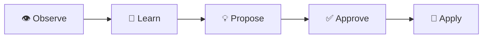
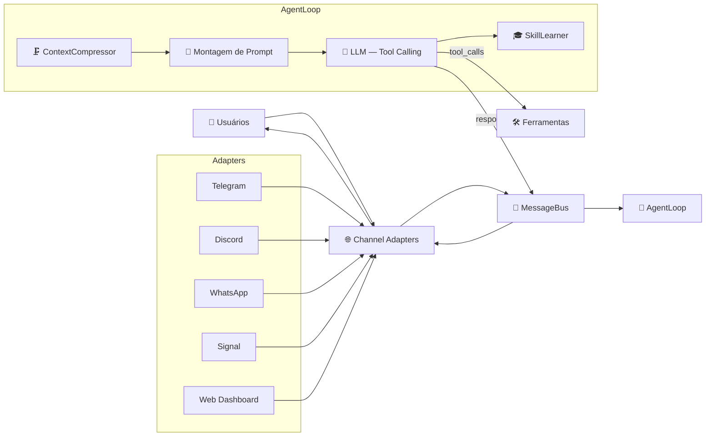

# NewClaw 🪐

> **Idiomas:**
> 🇺🇸 [English](README.md) | 🇧🇷 **Português** | 🇪🇸 [Español](README.es.md)

[](https://opensource.org/licenses/MIT)
[](https://nodejs.org/)
[](https://github.com/rovanni/NewClaw)
[](https://github.com/rovanni/NewClaw/pulls)

### Agente cognitivo autônomo com tool-calling nativo, grafo de memória semântica e fallback multi-provider.


O NewClaw é um **Agente Cognitivo Avançado** (100% local e privado), desenvolvido em Node.js (TypeScript). Ele é especializado na execução autônoma de tarefas através de chamadas de ferramentas nativas e gerenciamento de memória semântica de longo prazo.

## 🔀 Arquitetura Multi-Canal
O NewClaw possui uma **arquitetura baseada em MessageBus** que desacopla o núcleo cognitivo das interfaces de comunicação. Isso permite que o agente mantenha uma única memória e identidade consistente enquanto interage em múltiplas plataformas simultaneamente:

*   **Pipeline Unificado**: Todas as mensagens são normalizadas antes de chegarem ao agente.
*   **Identidade Persistente**: O agente é o mesmo no Telegram, Discord ou qualquer outro canal.
*   **Comandos Multi-Plataforma**: Comandos como `/clear` ou `/skills` funcionam em todos os canais.
*   **Suporte a Mídia**: Processamento nativo de texto, voz, fotos e documentos em todos os adaptadores.

## 🧠 Cognição Atômica: Núcleo de Decisão Unificado

O diferencial do NewClaw é a sua **Arquitetura de Cognição Atômica**. Diferente de agentes tradicionais que seguem uma cadeia lenta e linear de etapas separadas, o NewClaw processa toda a inteligência estratégica em um único turno atômico unificado:

1.  **Raciocínio Unificado**: O agente pensa, decide a ação e avalia sua própria completude em uma única resposta JSON estruturada.
2.  **Eficiência Extrema**: Elimina a latência de múltiplas chamadas LLM sequenciais, resolvendo tarefas em apenas 1 ou 2 ciclos de decisão de alto valor.
3.  **Auto-Avaliação Nativa**: O cálculo de confiança e a validação de objetivos acontecem naturalmente dentro do raciocínio interno do modelo, sem supervisores externos.
4.  **Robusto e Resiliente**: Possui parsing avançado de JSON com recuperação automática de erros de formatação e vazamentos de markdown.
5.  **Limpo e Direto**: Prioriza respostas úteis e baseadas em evidências sobre perfeccionismo estético ou execução excessiva.

Isso garante que o agente **"pense uma vez, mas pense profundo"**, oferecendo autonomia de nível profissional com o mínimo de latência.

## 🚀 O Diferencial NewClaw

O que torna o NewClaw único é o seu foco em **Consistência Cognitiva de Longo Prazo** e **Confiabilidade Estrutural**:

*   🛡️ **Privacidade Local-First**: Seus dados, memórias e modelos permanecem sob seu controle total, sem coleta de dados por terceiros.
*   🗺️ **Modelo de Mundo Evolutivo**: Diferente de bots reativos, o NewClaw constrói um grafo semântico persistente de suas preferências, projetos e infraestrutura.
*   🏗️ **Raciocínio Estrutural Nativo**: O agente não "adivinha" como usar ferramentas via texto; ele utiliza chamadas de função nativas para interagir com o sistema com precisão cirúrgica.
*   🔄 **Resiliência Extrema**: Com uma cadeia de fallback multi-provider e roteamento inteligente, o sistema garante continuidade mesmo se um provedor ou modelo falhar.
*   🎓 **Auto-Otimização de Skills**: O agente observa padrões em sua própria execução e propõe novas habilidades reutilizáveis para se tornar mais eficiente com o tempo.

### 🔄 Ciclo de Aprendizado
O NewClaw não apenas armazena dados; ele evolui. O sistema segue um loop contínuo de otimização:

*Observar padrões → Aprender interações → Propor skills → Aprovação do usuário → Aplicar no futuro.*

## ⚙️ Modos de Operação
O agente atua em quatro modos distintos dependendo da complexidade da tarefa:
1.  💬 **Responder**: Conversa natural e raciocínio usando contexto de longo prazo.
2.  🔍 **Buscar**: Síntese multi-fonte e pesquisa baseada em evidências.
3.  🧭 **Explorar**: Navegação web ativa e interação profunda com páginas.
4.  ⚡ **Executar**: Comandos diretos no sistema e operações de arquivo precisas.

## ✨ Funcionalidades

| Feature | Descrição |
|---------|-----------|
| 🧠 **Memória Semântica** | SQLite + FTS5 + embeddings, 7 tipos de nó, 14+ relações e curadoria avançada. |
| 👁️ **Camada de Atenção** | Sistema de priorização contextual que reclassifica a memória com base no feedback. |
| 🔀 **Multi-Canal** | Suporte nativo a **Telegram, Discord, WhatsApp, Signal** e **Web**. |
| 📞 **Tool Calling Nativo** | Chamada estrutural (Ollama/Gemini) para precisão absoluta sem parsing de texto. |
| 🧭 **Model Router** | Roteamento inteligente para modelos especializados (Chat, Code, Vision, Analysis). |
| 🔄 **Provider Fallback** | Resiliência multi-provider: Ollama → Gemini → DeepSeek → Groq. |
| ⚖️ **Governança de Memória**| Memória auto-regulada com decaimento de confiança e arquivamento reversível. |
| 🎓 **SkillLearner** | Reconhecimento de padrões que alimenta o **Ciclo de Aprendizado**. |
| 🌐 **Busca Web** | Pesquisa iterativa multi-fonte com síntese e leitura de páginas. |
| 🧭 **Exploração Ativa** | Navegação web em modo terminal para interação profunda (suporte a `w3m`). |
| 📊 **Dashboard Web** | Chat em tempo real, config, curadoria de memória e grafo interativo. |
| 📸 **Snapshots** | Versionamento do grafo: criar, restaurar, listar e deletar snapshots. |
| 🖥️ **SSH Exec** | Execução remota de comandos via SSH para infraestrutura multi-servidor. |
| 🛡️ **Auditor de Auto-Diagnóstico** | Comando `/audit` (owner-only): verifica código, runtime e auto-correção. |

## 🏗️ Arquitetura

### Fluxo de Mensagens



### Sistema de Sessões (v2)

O NewClaw utiliza uma **arquitetura de sessão baseada em eventos** para garantir continuidade total na conversa:

| Componente | Propósito |
|-----------|---------|
| **SessionTranscript** | Log JSONL append-only, cada evento gravado com metadados |
| **SessionManager** | Mutex por sessão, compressão híbrida (20 msgs OU 3000 tokens) |
| **SessionContext** | Constrói o contexto LLM: prompt → checkpoint → mensagens → memória |
| **SessionLearner** | Extrai fatos das conversas para o grafo cognitivo |

## 🚀 Instalação

### Instalação Rápida — Linux/macOS (Recomendado)

```bash
curl -fsSL https://raw.githubusercontent.com/rovanni/NewClaw/main/install.sh | bash
```

### Instalação Rápida — Windows 🪟

**Execute o PowerShell como Administrador:**

```powershell
irm https://raw.githubusercontent.com/rovanni/NewClaw/main/install.ps1 | iex
```

### Comandos CLI

| Comando | Descrição |
|---|---|
| `newclaw start` | Inicia o agente |
| `newclaw stop` | Encerra o serviço graciosamente |
| `newclaw status` | Health check e uptime |
| `newclaw logs -f` | Logs em tempo real |
| `newclaw update` | Atualiza e recompila o projeto |
| `newclaw passwd` | Define ou altera a senha do Dashboard web |
| `newclaw onboard` | Configura provedores e chaves de API |
| `newclaw channels` | Status dos canais (Telegram, Discord, WhatsApp, Signal) |
| `newclaw channels enable <nome>` | Configura um canal |
| `newclaw channels disable <nome>` | Desativa um canal |

---

## 🛡️ Auditor de Auto-Diagnóstico

O NewClaw inclui um **Agente de Auto-Diagnóstico** que usa o LLM local para analisar seu próprio código e comportamento.

> **💡 Como usar:** O comando `/audit` funciona em **qualquer canal** (Telegram, Discord, etc.). É **restrito ao proprietário**.

| Comando | Descrição | Tempo |
|---------|-----------|-------|
| `/audit` | Auditoria completa (código + runtime + dados + integração) | ~1-3 min |
| `/audit fix` | **Auto-correção** — só aplica correções de baixo risco validadas | ~1-5 min |
| `/cancel` | Cancela a operação em andamento (`/cancelar`, `/stop`, `/pare` também funcionam) | instantâneo |

---

## 🗺️ Roadmap
O roadmap detalhado do projeto pode ser encontrado em [docs/ROADMAP.md](docs/ROADMAP.md).

## 📄 Licença
Este projeto está sob a licença MIT.

---
*NewClaw — O Futuro dos Agentes Cognitivos Locais* 🪐
