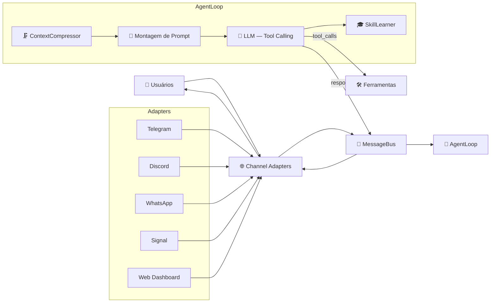

# NewClaw 🪐

> **Idiomas:**
> 🇺🇸 [English](README.md) | 🇧🇷 **Português** | 🇪🇸 [Español](README.es.md)

[](https://opensource.org/licenses/MIT)
[](https://nodejs.org/)
[](https://github.com/rovanni/NewClaw)
[](https://github.com/rovanni/NewClaw/pulls)

---

> **Você:** "Minha filha adora matemática."
>
> *Dois dias depois:*
>
> **Você:** "O que você sabe sobre minha família?"
> **NewClaw:** "Sua filha adora matemática."
>
> *Sem fine-tuning. Sem contexto injetado manualmente. Sem repetir a mesma coisa.*

---

## O assistente de IA que realmente lembra de você

Todo assistente de IA hoje esquece tudo assim que a sessão termina. Você se repete constantemente. O contexto que você construiu na semana passada sumiu. O agente nunca aprende quem você é de verdade.

**O NewClaw é diferente.**

Ele roda localmente na sua máquina, constrói uma memória persistente sobre quem você é, e continua com você no Telegram, WhatsApp e Discord — mesmo depois de semanas ou meses. O mesmo agente. A mesma memória. Sempre.

---

## Veja na prática

### Memória que persiste ao longo do tempo

```
Você: "Estou trabalhando em um projeto chamado Orion — é um sistema de gestão de clientes."
NewClaw: "Entendido. Adicionei Orion aos seus projetos conhecidos."

[Uma semana depois]

Você: "Quais projetos estou tocando?"
NewClaw: "Você tem o Orion — um sistema de gestão de clientes que você mencionou semana passada."
```

### Contexto que molda respostas futuras

```
Você: "Odeio reuniões antes das 10h da manhã."

[Alguns dias depois]

Você: "Marca uma reunião com o time amanhã."
NewClaw: "Vou sugerir horários depois das 10h, já que você prefere assim."
```

### O mesmo agente em todo lugar

Você manda um áudio no Telegram de manhã. Mais tarde abre o dashboard web. À noite responde pelo Discord. É o mesmo NewClaw — com a mesma memória e o mesmo contexto — em todos os canais.

---


*Grafo de memória real — 65 nós, 167 arestas. Labels removidos por privacidade.*

---

## Instalação Rápida

**Linux/macOS:**
```bash
curl -fsSL https://raw.githubusercontent.com/rovanni/NewClaw/main/install.sh | bash
```

**Windows (PowerShell como Administrador):**
```powershell
irm https://raw.githubusercontent.com/rovanni/NewClaw/main/install.ps1 | iex
```

### Requisitos

- Windows 10 (1809+) / Windows 11, ou Linux/macOS
- Node.js 22+ (o instalador instala automaticamente se não encontrar)
- 2GB+ de RAM, 5GB+ de espaço livre em disco
- Nenhum canal de chat é obrigatório para começar — o NewClaw funciona sozinho pelo
  Dashboard Web local (`http://localhost:3090`). Adicione Telegram, Discord, WhatsApp ou
  Signal depois, quando quiser, com `newclaw channels enable <canal>`.

### Problemas comuns na instalação

- **Windows — "não pode ser carregado porque a execução de scripts foi desabilitada neste
  sistema"**: isso só acontece se você baixou o arquivo e rodou `.\install.ps1` diretamente,
  em vez do comando `irm | iex` acima (que não sofre essa restrição). Resolva uma vez com:
  ```powershell
  Set-ExecutionPolicy RemoteSigned -Scope CurrentUser
  ```
  Isso afeta só a sua conta de usuário, não a máquina toda, e também evita esse mesmo
  bloqueio em comandos `npm` depois. O instalador já verifica e corrige isso automaticamente
  quando consegue rodar.
- **Windows — o PM2 não conecta / o bot não fica no ar**: geralmente é um daemon do PM2
  iniciado sob outro nível de privilégio, deixado para trás (erro `EPERM` no named pipe).
  Rode `newclaw doctor` para um diagnóstico completo, ou use `npm start` como alternativa
  (sem auto-restart, mas funciona).
- **A qualquer momento**: rode `newclaw doctor` para checar Node, PM2, Ollama, canais
  configurados, espaço em disco e auto-início no Windows, tudo de uma vez.

---

## Como o NewClaw se compara

| Outros assistentes | NewClaw |
|---|---|
| Esquece tudo ao fim de cada sessão | Memória persistente — lembra por dias, semanas, meses |
| Seus dados ficam nos servidores de terceiros | 100% local — seus dados nunca saem da sua máquina |
| Uma interface (geralmente só um chat) | Telegram, WhatsApp, Discord, Signal, Web — um único agente |
| Começa do zero em toda conversa | Constrói um modelo de mundo sobre você que evolui com o tempo |
| Exige assinaturas caras de API | Roda em modelos locais (Ollama) com cloud como fallback opcional |

---

## O que você pode fazer com ele

- **Perguntar qualquer coisa sobre seu histórico** — preferências, decisões, projetos, pessoas que você mencionou
- **Usar qualquer canal** — Telegram, WhatsApp, Discord, dashboard web, ou todos ao mesmo tempo
- **Manter seus dados privados** — 100% local, sem cloud obrigatório
- **Deixá-lo aprender seus padrões** — ele propõe atalhos com base em como você realmente trabalha
- **Rodar no seu servidor** — serviço persistente em background, suporte a SSH, multi-instância

---

## Funcionalidades

| Feature | O que faz por você |
|---|---|
| 🧠 **Memória Semântica** | Lembra pessoas, preferências, projetos, fatos — e as conexões entre eles |
| 🔀 **Multi-Canal** | Telegram, Discord, WhatsApp, Signal, Web — um agente em todos os canais |
| 🛡️ **Local-First** | Sem cloud obrigatório. Sem coleta de dados. Roda no seu hardware |
| 🎓 **Aprendizado de Skills** | Observa como você trabalha e propõe atalhos reutilizáveis com o tempo |
| 🔄 **Fallback de Provedores** | Ollama → Gemini → DeepSeek → Groq — troca automaticamente se um falhar |
| 📊 **Dashboard Web** | Grafo de memória visual, chat em tempo real, configuração completa |
| 🌐 **Busca Web** | Pesquisa temas e sintetiza respostas a partir de múltiplas fontes |
| 🖥️ **SSH Exec** | Execute comandos em servidores remotos direto pelo chat |
| 📸 **Snapshots de Memória** | Versione o conhecimento do agente — crie, restaure e compare estados |
| 🛡️ **Auto-Auditoria** | O agente inspeciona e corrige seu próprio runtime com `/audit` |

---


*Dashboard Web — visualização interativa do grafo com tipos de nó: Identidade, Preferência, Projeto, Contexto, Fato, Habilidade.*

---

## Comandos CLI

| Comando | Descrição |
|---|---|
| `newclaw start` | Inicia o agente |
| `newclaw stop` | Encerra o serviço graciosamente |
| `newclaw status` | Health check, PID e uptime |
| `newclaw logs -f` | Logs em tempo real |
| `newclaw update` | Atualiza e recompila o projeto |
| `newclaw passwd` | Define ou altera a senha do Dashboard |
| `newclaw onboard` | Configura provedores e chaves de API |
| `newclaw channels` | Status dos canais (Telegram, Discord, WhatsApp, Signal) |
| `newclaw channels enable <nome>` | Ativa um canal |
| `newclaw channels disable <nome>` | Desativa um canal |

---

## Auditor de Auto-Diagnóstico

O NewClaw consegue inspecionar seu próprio código e comportamento em runtime usando o LLM local.

> **Restrito ao proprietário.** Funciona em qualquer canal (Telegram, Discord, etc.).

| Comando | Descrição | Tempo |
|---|---|---|
| `/audit` | Auditoria completa — código, runtime, dados, integrações | ~1-3 min |
| `/audit fix` | Auto-correção — aplica apenas correções de baixo risco validadas | ~1-5 min |
| `/cancel` | Cancela a operação em andamento (`/cancelar`, `/stop`, `/pare` também funcionam) | instantâneo |

---

<details>
<summary>⚙️ Como funciona internamente</summary>

### Fluxo de Mensagens



Para a filosofia arquitetural completa por trás disso (por que os canais nunca tocam lógica de IA,
o que é proibido importar onde, como adicionar um canal novo), veja
[docs/ARCHITECTURE.md](docs/ARCHITECTURE.md).

### Sistema de Sessões (v2)

| Componente | Propósito |
|---|---|
| **SessionTranscript** | Log JSONL append-only, cada evento gravado com número de sequência e metadados |
| **SessionManager** | Mutex por sessão, compressão híbrida (20 msgs OU 3000 tokens) |
| **SessionContext** | Constrói o contexto LLM: prompt → checkpoint → mensagens recentes → memória semântica |
| **SessionLearner** | Extrai fatos das conversas para o grafo cognitivo |

### Modos de Operação

O agente atua em quatro modos dependendo da complexidade da tarefa:

1. 💬 **Responder** — Conversa natural usando contexto de longo prazo
2. 🔍 **Buscar** — Síntese multi-fonte e pesquisa baseada em evidências
3. 🧭 **Explorar** — Navegação web ativa e interação profunda com páginas
4. ⚡ **Executar** — Comandos diretos no sistema e operações de arquivo

</details>

---

## Roadmap

O roadmap detalhado está em [docs/ROADMAP.md](docs/ROADMAP.md).

## Licença

MIT — [opensource.org/licenses/MIT](https://opensource.org/licenses/MIT)

---

*NewClaw — A IA que realmente lembra de você.* 🪐
