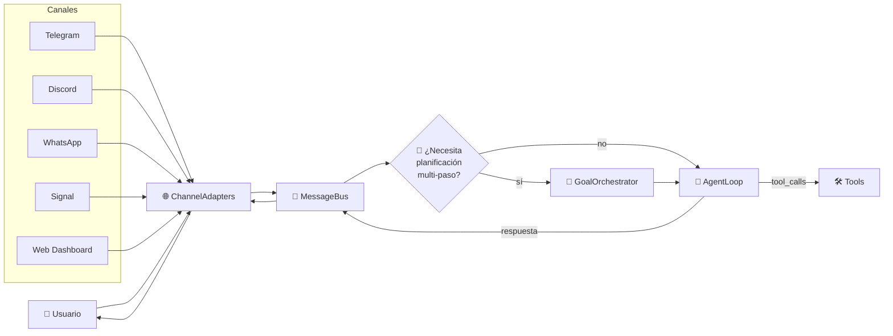
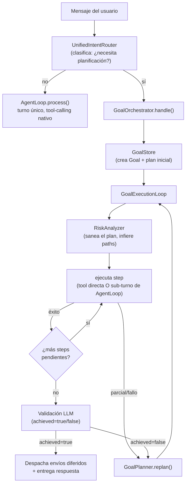
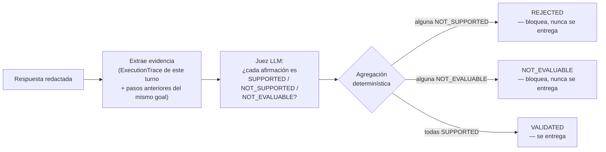
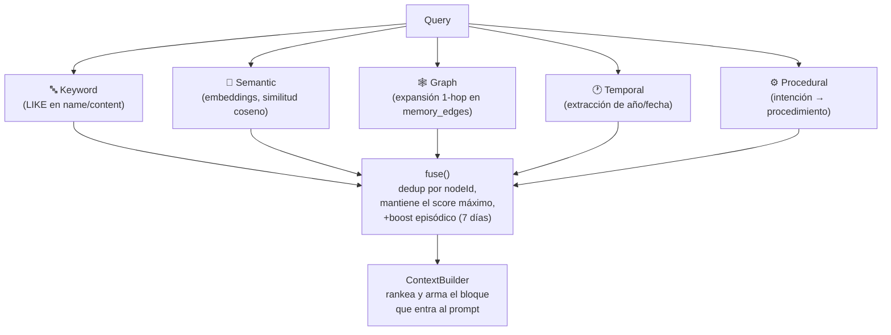
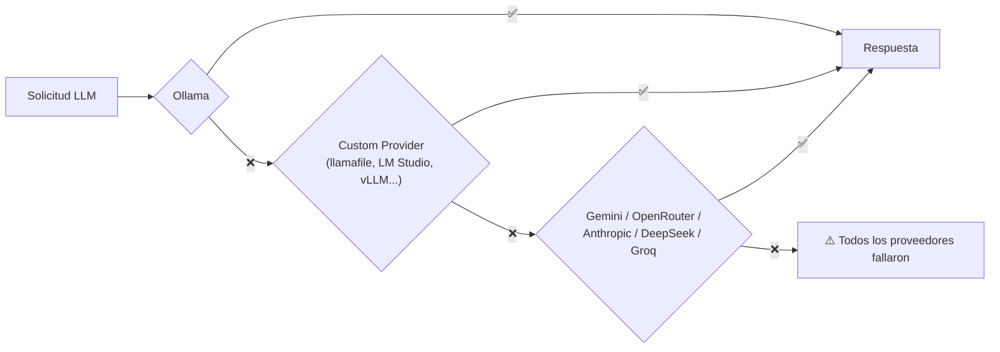

# NewClaw — Visión Técnica 🪐

> **Idioma:** [English](TECHNICAL_OVERVIEW.md) | [Português](TECHNICAL_OVERVIEW.pt-br.md) | 🇪🇸 **Español**

> Este documento es el complemento técnico del [README](../README.es.md). El README responde "qué
> hace NewClaw por ti"; este documento responde "cómo lo hace, por dentro". Escrito para quien va
> a leer el código, contribuir, o simplemente entender por qué existe una decisión de arquitectura.
>
> Referencia normativa completa: [docs/ARCHITECTURE.md](ARCHITECTURE.md) (filosofía de canales) y
> [docs/ARCHITECTURE/](ARCHITECTURE/) (principios arquitectónicos + ADRs en `docs/decisoes/`).

---

## Filosofía: un Core de IA, los canales son solo puertas

NewClaw no es un bot de Telegram, WhatsApp, o un dashboard web. Es un **Core de IA** (memoria,
planificación, herramientas, ejecución) que se comunica a través de canales — ninguno de ellos
contiene lógica de IA. `src/loop/**` nunca importa un `*Adapter`; ningún `*Adapter` importa jamás
`AgentLoop`/`GoalOrchestrator`/`ToolRegistry`. Ese límite es verificable con `grep` y se trata como
un bug de arquitectura, no de estilo, si llega a violarse.

Todo canal produce un `NormalizedMessage` en la entrada y consume un `NormalizedResponse` en la
salida; el preprocesamiento de medios (`agentMediaHandlers`) produce **hechos** — nunca decide qué
ve la IA, ni redacta la respuesta.

---

## Dos modos de ejecución: conversación directa vs. objetivo con plan

`MessageBus` decide, por mensaje, si va directo a `AgentLoop` (intercambio simple, una pregunta
que una sola herramienta resuelve) o abre un **Goal** — un objetivo con plan de múltiples pasos,
replanificación y validación antes de entregar la respuesta.

**Por qué dos caminos, no uno solo:** la mayoría de los mensajes ("hola", "qué hora es", "cómo
está el clima") no necesitan plan, replanificación ni validación por LLM — eso sería latencia y
costo desperdiciados. `Goal` existe para tareas que realmente requieren múltiples pasos
coordinados (investigar → calcular → generar archivo → enviar), con estado persistido en SQLite
(`GoalStore`) para sobrevivir a reinicios.

Cada `Goal` lleva `planGeneration` — un contador que avanza en cada sustitución *total* del plan
(una replanificación real, no un reintento del mismo step). `(planGeneration, planStepId)` es la
clave de unión que evita que un intento de una estrategia ya abandonada "gane" sobre un intento de
la estrategia vigente solo por haberse insertado antes en el array.

---

## La barrera de groundedness (ADR-010)

Después de que `AgentLoop` redacta una respuesta final, esta pasa por **dos** compuertas
independientes antes de llegar al usuario — contratos hermanos, ninguno reemplaza al otro:

| Compuerta | Pregunta que responde |
|---|---|
| **ResponseCommit** (Q4) | ¿La herramienta realmente se ejecutó, o el agente está alucinando una acción? |
| **Groundedness** (C1, ADR-010) | ¿Los números/hechos de la respuesta coinciden con lo que la herramienta realmente devolvió? |

La compuerta de groundedness extrae cada afirmación factual de la respuesta y la clasifica contra
la evidencia real del turno (`ExecutionTrace`) usando un juez LLM dedicado:

Regla central: **la ausencia de contradicción no es soporte.** Si la evidencia no determina la
afirmación, el veredicto es `NOT_EVALUABLE`, nunca `SUPPORTED` — un número presente en la
evidencia sin la unidad determinada no sustenta "está a 25°C". Un fallo del propio juez (timeout,
salida malformada, proveedor no disponible) se convierte en `UNVALIDATED` y **también bloquea** —
la compuerta es fail-closed por diseño, nunca fail-open.

La evidencia incluye tanto el `ExecutionTrace` del turno actual como — cuando el turno corre como
*step* de un `Goal` — hechos reales (`result='success'`) de pasos anteriores de la misma
`planGeneration`, para que el juez no bloquee una afirmación que reutiliza legítimamente un valor
ya obtenido antes, en lugar de volver a consultar la herramienta sin necesidad.

Este es el mecanismo concreto detrás del principio general del proyecto: **el determinismo valida,
el LLM interpreta.** Groundedness es una pregunta semántica ("¿esto está sustentado?") — por eso
el mecanismo es un LLM, no regex. Pero agregar veredictos en un estado final es una pregunta
estructural (precedencia sobre un enum cerrado) — por eso es determinística. Ver
[docs/ARCHITECTURE/RESPONSABILIDADE_ANTES_DO_MECANISMO.md](ARCHITECTURE/RESPONSABILIDADE_ANTES_DO_MECANISMO.md).

---

## Memoria semántica

Almacenamiento: **SQLite** (`better-sqlite3`) con **FTS5** para búsqueda de texto y una tabla
dedicada de embeddings (vía Ollama, `nomic-embed-text` por defecto, 768 dimensiones — almacenados
como BLOB, sin depender de ninguna extensión vectorial nativa).

**Tipos de nodo:** `identity`, `preference`, `project`, `context`, `fact`, `skill`,
`infrastructure`, `trait`, `rule`, `strategy`, `knowledge`, `domain`. Cada nodo lleva
`confidence`, `pagerank`/`degree`/`community_id` (métricas de grafo) y un `LifecycleState`
(`ACTIVE → SUMMARIZED → ARCHIVED/EXPIRED/SUPERSEDED`).

### Recuperación en múltiples capas

`ContextBuilder` decide qué entra realmente al prompt del LLM: un ranking declarado como
`similitud*0.6 + conectividad*0.25 + recencia*0.15`, seleccionando típicamente 5-8 nodos, dentro
de un presupuesto de tokens por bloque (`ContextBudget`: aproximadamente 1500 tokens de system
prompt, 1000 de memoria, 2000 de historial reciente — números indicativos, ajustables por `tier`).

### Distribuido × Aprendido

Un límite normativo que atraviesa todo el sistema de memoria y conocimiento (ver
[SEPARACAO_DISTRIBUIDO_APRENDIDO.md](ARCHITECTURE/SEPARACAO_DISTRIBUIDO_APRENDIDO.md)):

| | **Distribuido** | **Aprendido** |
|---|---|---|
| Dónde vive | Código fuente versionado (ej: `KNOWN_DEPS` en `GoalEvaluator.ts`) | SQLite local de la instancia |
| Cómo cambia | PR humano, revisado | Runtime, automático |
| Ejemplo | Comandos de instalación conocidos y validados | `ReflectionMemory`, `CaseMemory`, `OperationalKnowledge` |

Un hecho aprendido **nunca** se autopromueve al catálogo distribuido — el único cruce legítimo es
un PR humano manual leyendo la evidencia aprendida y decidiendo incorporarla al código.

### Memoria post-ejecución

- **`ReflectionMemory`** — persiste el resultado de cada validación (`ObserverValidator`), agrega
  patrones de error por herramienta, e inyecta un resumen (`buildContextHint()`) en el prompt
  cuando la tasa de fallo de una herramienta supera un umbral.
- **`CaseMemory`** — captura casos de éxito comprobado (un criterio de éxito cumplido, o un
  artefacto realmente entregado). Hoy en **modo sombra**: no influye en `GoalPlanner`,
  `RiskAnalyzer` ni en la elección de herramientas — solo captura y consulta diagnóstica.
- **`OperationalKnowledge`** — comandos de instalación aprendidos en runtime cuando una
  dependencia faltante se resuelve con éxito, indexados por `(herramienta, plataforma)`.

---

## Herramientas

| Categoría | Herramientas |
|---|---|
| **Memoria** | `memory_search`, `memory_write`, `memory_admin`, `manage_memory`, `cmi_inspect` |
| **Web** | `web_search`, `web_navigate` (usa `w3m`/`lynx`/`links`/`elinks` cuando está disponible, fallback a HTML), `api_request` |
| **Sistema/archivos** | `exec_command`, `ssh_exec`, `read`, `write`, `edit`, `read_document`, `list_workspace`, `organize_workspace`, `refresh_workspace`, `analyze_workspace_groups`, `schedule` |
| **Media/documentos** | `send_document`, `send_audio`, `powerpoint_control` |
| **Datos/financiero** | `crypto_analysis`, `crypto_report`, `weather` |

Las herramientas peligrosas (`exec_command`, `ssh_exec`, `api_request` contra hosts arbitrarios)
requieren autorización — ver la sección de modos más abajo.

---

## Skills

Una skill es un `SKILL.md` con frontmatter YAML (`name`, `description`, `triggers`, `tools`,
`tags`) cargado por `SkillLoader` (caché de 10s). `SkillDiscovery` compara el mensaje del usuario
contra las `tags`/`triggers` de cada skill mediante intersección de tokens normalizados — sin
embeddings, sin llamada extra a un LLM solo para averiguar qué skill aplica.

Skills instaladas hoy:

| Skill | Qué hace |
|---|---|
| `content-validator` | Valida la sintaxis de archivos generados (HTML/JS/Python/JSON) y hace revisión visual de artefactos renderizados antes de enviarlos |
| `dependency-curator` | Investiga comandos de instalación cross-platform con fuente citada — nunca instala, produce un informe para aprobación humana |
| `html-pdf-converter` | Convierte HTML (incluyendo slides con JS) a PDF |
| `pptx-generator` | Convierte Markdown/HTML en un `.pptx` editable |
| `skill-auditor` | Audita skills de terceros por seguridad (prompt injection, exfiltración) — análisis estático, nunca ejecuta |
| `skill-manager` | Instala y gestiona skills desde repositorios/`skills.sh` |
| `system-provisioner` | Instala dependencias del sistema (pip, npm, apt) |

---

## Proveedores de LLM y enrutamiento por modelo

### Cadena de fallback

Orden real (`ProviderFactory.getFallbackOrder`): el proveedor preferido (si lo hay) va primero;
si no, `['ollama', 'openrouter', 'anthropic', 'gemini', 'deepseek', 'groq']`, filtrado a lo que
esté realmente configurado, con los custom providers añadidos al final. `DEFAULT_PROVIDER` en el
`.env` tiene prioridad sobre este orden cuando está definido.

### Enrutamiento por categoría

Cada llamada al LLM se enruta a un perfil de modelo por categoría — no es "un modelo para todo":

| Categoría | Uso típico |
|---|---|
| `chat` | Conversación general, razonamiento |
| `code` | Programación, edición de archivos, scripts |
| `vision` | Análisis de imágenes, OCR |
| `light` | Respuestas cortas (hola, ok, gracias) |
| `analysis` | Cripto, datos de mercado, estadística |
| `execution` | Loops de herramientas complejos, múltiples pasos |

La clasificación es primero **determinística** (regex/keyword contra `FallbackRule[]`, 0ms) — un
LLM ligero entra solo como fallback para casos ambiguos. Cada categoría puede tener su propio
`PROVIDER_<CATEGORÍA>` en el `.env`; si está vacío, hereda `DEFAULT_PROVIDER`.

### 🖥️ Modelos locales totalmente offline — llamafile y `.gguf`

Además de Ollama/nube, NewClaw puede correr **modelos `.gguf` completamente offline** vía
[llamafile](https://github.com/Mozilla-Ocho/llamafile)/`llama-server` — sin depender de ningún
servicio externo, ni siquiera del propio Ollama.

- Apunta `LOCAL_MODELS_DIR` (en el `.env` o desde el Dashboard) a la carpeta donde guardas tus
  archivos `.gguf`. NewClaw la escanea y lista los modelos que encuentra.
- Al elegir "usar este modelo" en el Dashboard, NewClaw levanta (`spawn`, sin shell — sin riesgo
  de inyección de comandos) un proceso local `llamafile`/`llama-server`, sirviendo un endpoint
  compatible con OpenAI en el puerto configurado (`LOCAL_SERVER_PORT`, por defecto `8080`).
- Ese endpoint pasa a comportarse como **un proveedor más** en la cadena de fallback — puede
  definirse como `DEFAULT_PROVIDER`, asignarse a categorías específicas vía
  `PROVIDER_<CATEGORÍA>`, o quedar como fallback silencioso si todo lo demás falla.
- Los modelos locales añadidos manualmente vía `CUSTOM_PROVIDERS`/`CUSTOM_MODELS` (JSON en el
  `.env`) siguen el mismo contrato — cualquier servidor compatible con OpenAI (LM Studio, vLLM, un
  llamafile ya corriendo en otra máquina de la red) se integra de la misma forma, sin código nuevo.

Este es el camino para correr NewClaw **sin internet, sin cuenta en ningún proveedor, y sin costo
por token** — solo la máquina local y un archivo `.gguf`.

---

## Sesiones y contexto

| Componente | Responsabilidad |
|---|---|
| **SessionManager** | Aísla sesiones por `canal:usuario`, mutex por sesión (evita corrupción concurrente), compresión híbrida (conteo de mensajes O estimación de tokens) |
| **SessionTranscript** | Log JSONL append-only, un archivo por sesión, con índice de búsqueda para replay rápido desde el último checkpoint |
| **SessionContext** | Arma el contexto del turno como bloques separados (system prompt → estado → memoria → checkpoint → historial reciente → mensaje actual) — nunca una concatenación monolítica |
| **SessionKeyFactory** | Fuente única para componer/descomponer `canal:usuario` — existe porque varios consumidores lo hacían de forma independiente, truncando en silencio cualquier `userId` que contuviera `:` |
| **SkillLearner/SessionLearner** | Extrae hechos de la conversación (nombres, preferencias, proyectos) hacia el grafo de memoria |

---

## Autorización y modos de operación

Tres modos (`CapabilityMode`), cada uno controlando una matriz de capacidades
(`auto_approve_exec`, `install_dependencies`, `modify_core`, `access_secrets`, ...):

| Modo | Comportamiento |
|---|---|
| **SAFE** | Nada se auto-aprueba — toda acción peligrosa pide confirmación |
| **DEVELOPER** | Autonomía intermedia |
| **GOD** | Autonomía total — aun así, las protecciones absolutas siguen aplicando |

**Protecciones absolutas, en cualquier modo:** log de auditoría completo, bloqueo incondicional de
comandos catastróficos (`rm -rf /`, `mkfs`, `dd if=`, fork bombs, `shutdown`/`reboot` — detección
estructural en `src/shared/destructiveCommandPatterns.ts`, nunca vía LLM), confirmación
obligatoria para eliminación masiva, remoción de directorios, o acceso a credenciales/secretos.

La compuerta "¿esta acción necesita autorización?" vive en un único lugar
(`ToolRegistry.requiresAuthorization()`), consultada tanto por `AgentLoop` (turno conversacional)
como por `GoalExecutionLoop` (step de un plan) — consolidada después de un bug real donde la regla
solo existía en el primer camino, dejando que un `exec_command` peligroso se ejecutara sin
compuerta cuando venía desde dentro de un plan de goal en modo SAFE.

Cuando una acción requiere aprobación, `WorkflowEngine` crea una transacción y el canal (Telegram,
Discord, WhatsApp, Signal) muestra botones de aprobar/rechazar que responden **fuera** del
pipeline conversacional — sin regex, sin replay de contexto, directo al motor de workflow.

---

## Dashboard

Mucho más que una ventana de chat: un grafo de memoria completo (visualización, CRUD de
nodos/aristas, snapshots versionados, analítica), catálogo e instalación de modelos (nube y
locales), gestión de proveedores (incluyendo custom compatibles con OpenAI), skills (instalación,
auto-descubrimiento con aprobación humana), modo de capacidad, perfil y log de auditoría del
owner, backup/restore programado, y un trace completo de ejecución de cada turno.

---

## A dónde ir desde aquí

- [docs/ARCHITECTURE.md](ARCHITECTURE.md) — filosofía de canales, qué está prohibido importar dónde, cómo añadir un canal nuevo
- [docs/ARCHITECTURE/](ARCHITECTURE/) — principios normativos (Evidence Provider Pattern, Nunca Adivinar, Responsabilidad antes del Mecanismo, Localidad de la Recuperación, Soberanía de la Configuración)
- [docs/decisoes/](decisoes/) — ADRs numerados (decisiones puntuales, cada una con el incidente real que la motivó) y RFCs
- [docs/ROADMAP.md](ROADMAP.md) — hacia dónde va el proyecto
