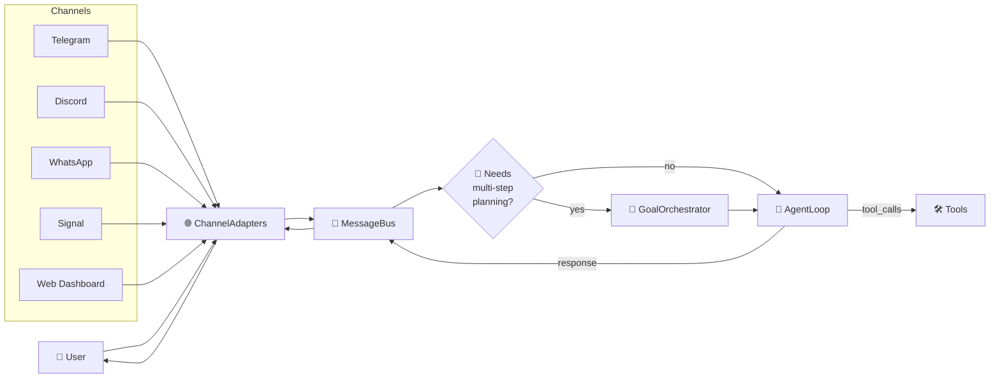
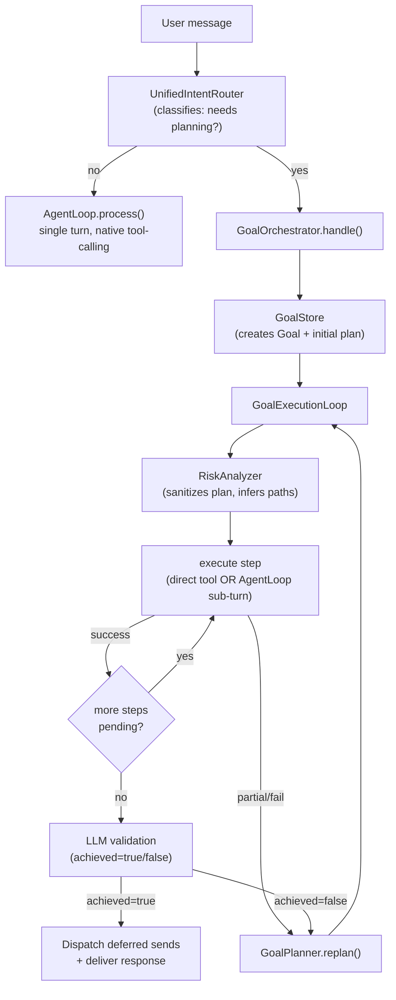
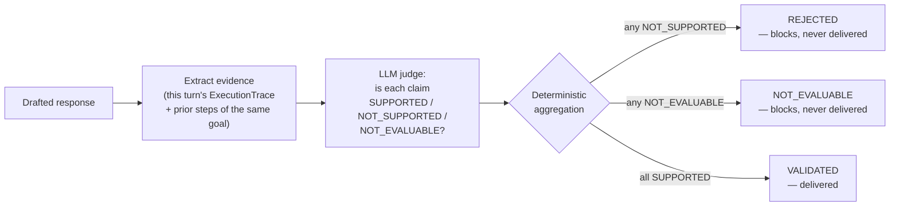
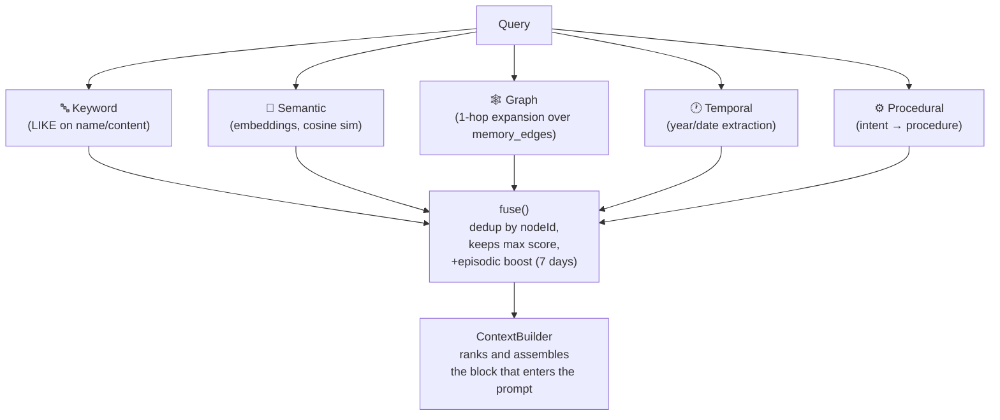
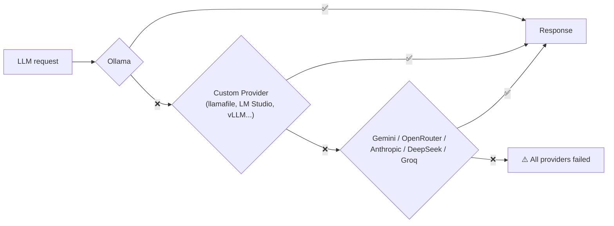

# NewClaw — Technical Overview 🪐

> **Language:** 🇺🇸 **English** | [Português](TECHNICAL_OVERVIEW.pt-br.md) | [Español](TECHNICAL_OVERVIEW.es.md)

> This document is the technical companion to the [README](../README.md). The README answers
> "what NewClaw does for you"; this document answers "how it does it, under the hood." Written
> for anyone who's about to read the code, contribute, or just wants to understand why an
> architectural decision exists.
>
> Full normative reference: [docs/ARCHITECTURE.md](ARCHITECTURE.md) (channel philosophy) and
> [docs/ARCHITECTURE/](ARCHITECTURE/) (architectural principles + ADRs in `docs/decisoes/`).

---

## Philosophy: an AI Core, channels are just doors

NewClaw is not a Telegram bot, a WhatsApp bot, or a web dashboard. It's an **AI Core** (memory,
planning, tools, execution) that communicates through channels — none of which contain any AI
logic. `src/loop/**` never imports a `*Adapter`; no `*Adapter` ever imports
`AgentLoop`/`GoalOrchestrator`/`ToolRegistry`. That boundary is `grep`-verifiable and treated as
an architecture bug, not a style nit, if it's ever violated.

Every channel produces a `NormalizedMessage` on the way in and consumes a `NormalizedResponse` on
the way out; media pre-processing (`agentMediaHandlers`) produces **facts** — it never decides
what the AI sees, and never drafts the response itself.

---

## Two execution modes: direct conversation vs. a planned goal

`MessageBus` decides, per message, whether it goes straight to `AgentLoop` (a simple exchange, one
question a single tool can resolve) or opens a **Goal** — an objective with a multi-step plan,
replanning, and validation before the response is delivered.

**Why two paths, not one:** most messages ("hi", "what time is it", "what's the weather") don't
need a plan, replanning, or LLM validation — that would be wasted latency and cost. `Goal` exists
for tasks that genuinely need multiple coordinated steps (research → compute → generate file →
send), with state persisted in SQLite (`GoalStore`) so it survives restarts.

Every `Goal` carries `planGeneration` — a counter that advances on every *full* plan replacement
(a real replan, not a retry of the same step). `(planGeneration, planStepId)` is the join key that
stops an attempt from an already-abandoned strategy from "winning" over an attempt from the
current one just because it was inserted earlier in the array.

---

## The groundedness barrier (ADR-010)

After `AgentLoop` drafts a final response, it passes through **two** independent gates before it
reaches the user — sibling contracts, neither replaces the other:

| Gate | Question it answers |
|---|---|
| **ResponseCommit** (Q4) | Did the tool actually run, or is the agent hallucinating an action? |
| **Groundedness** (C1, ADR-010) | Do the numbers/facts in the response match what the tool actually returned? |

The groundedness gate extracts every factual claim from the response and classifies it against the
turn's real evidence (`ExecutionTrace`) using a dedicated LLM judge:

Core rule: **absence of contradiction is not support.** If the evidence doesn't determine the
claim, the verdict is `NOT_EVALUABLE`, never `SUPPORTED` — a number present in the evidence
without a determined unit doesn't support "it's 25°C." A failure of the judge itself (timeout,
malformed output, provider unavailable) becomes `UNVALIDATED` and **also blocks** — the gate is
fail-closed by design, never fail-open.

Evidence includes both the current turn's `ExecutionTrace` and — when the turn runs as a *step* of
a `Goal` — real facts (`result='success'`) from earlier steps of the same `planGeneration`, so the
judge doesn't block a claim that legitimately reuses a value already obtained earlier, instead of
pointlessly re-querying the tool.

This is the concrete mechanism behind the project's general principle: **determinism validates,
the LLM interprets.** Groundedness is a semantic question ("is this supported?") — that's why the
mechanism is an LLM, not regex. But aggregating verdicts into a final state is a structural
question (precedence over a closed enum) — that's why it's deterministic. See
[docs/ARCHITECTURE/RESPONSABILIDADE_ANTES_DO_MECANISMO.md](ARCHITECTURE/RESPONSABILIDADE_ANTES_DO_MECANISMO.md).

---

## Semantic memory

Storage: **SQLite** (`better-sqlite3`) with **FTS5** for text search and a dedicated embeddings
table (via Ollama, `nomic-embed-text` by default, 768 dimensions — stored as BLOB, no native
vector-extension dependency).

**Node types:** `identity`, `preference`, `project`, `context`, `fact`, `skill`, `infrastructure`,
`trait`, `rule`, `strategy`, `knowledge`, `domain`. Each node carries `confidence`,
`pagerank`/`degree`/`community_id` (graph metrics), and a `LifecycleState`
(`ACTIVE → SUMMARIZED → ARCHIVED/EXPIRED/SUPERSEDED`).

### Multi-layer retrieval

`ContextBuilder` decides what actually makes it into the LLM's prompt: a declared ranking of
`similarity*0.6 + connectivity*0.25 + recency*0.15`, typically selecting 5-8 nodes, within a
per-block token budget (`ContextBudget`: roughly 1500 tokens for system prompt, 1000 for memory,
2000 for recent history — indicative numbers, adjustable by `tier`).

### Distributed vs. Learned

A normative boundary that runs through the entire memory/knowledge system (see
[SEPARACAO_DISTRIBUIDO_APRENDIDO.md](ARCHITECTURE/SEPARACAO_DISTRIBUIDO_APRENDIDO.md)):

| | **Distributed** | **Learned** |
|---|---|---|
| Where it lives | Versioned source code (e.g. `KNOWN_DEPS` in `GoalEvaluator.ts`) | Instance-local SQLite |
| How it changes | Human PR, reviewed | Runtime, automatic |
| Example | Known, validated install commands | `ReflectionMemory`, `CaseMemory`, `OperationalKnowledge` |

A learned fact **never** self-promotes into the distributed catalog — the only legitimate
crossing is a human manually reading the learned evidence and deciding to fold it into the code.

### Post-execution memory

- **`ReflectionMemory`** — persists the outcome of every validation (`ObserverValidator`),
  aggregates error patterns per tool, and injects a summary (`buildContextHint()`) into the
  prompt once a tool's failure rate crosses a threshold.
- **`CaseMemory`** — captures proven success cases (a success criterion met, or an artifact
  actually delivered). Currently in **shadow mode**: it doesn't influence `GoalPlanner`,
  `RiskAnalyzer`, or tool choice — only capture and diagnostic querying.
- **`OperationalKnowledge`** — install commands learned at runtime when a missing dependency is
  successfully resolved, keyed by `(tool, platform)`.

---

## Tools

| Category | Tools |
|---|---|
| **Memory** | `memory_search`, `memory_write`, `memory_admin`, `manage_memory`, `cmi_inspect` |
| **Web** | `web_search`, `web_navigate` (uses `w3m`/`lynx`/`links`/`elinks` when available, HTML fallback otherwise), `api_request` |
| **System/files** | `exec_command`, `ssh_exec`, `read`, `write`, `edit`, `read_document`, `list_workspace`, `organize_workspace`, `refresh_workspace`, `analyze_workspace_groups`, `schedule` |
| **Media/documents** | `send_document`, `send_audio`, `powerpoint_control` |
| **Data/financial** | `crypto_analysis`, `crypto_report`, `weather` |

Dangerous tools (`exec_command`, `ssh_exec`, `api_request` against arbitrary hosts) require
authorization — see the modes section below.

---

## Skills

A skill is a `SKILL.md` with YAML frontmatter (`name`, `description`, `triggers`, `tools`, `tags`)
loaded by `SkillLoader` (10s cache). `SkillDiscovery` matches the user's message against each
skill's `tags`/`triggers` via normalized-token intersection — no embeddings, no extra LLM call
just to figure out which skill applies.

Skills installed today:

| Skill | What it does |
|---|---|
| `content-validator` | Validates syntax of generated files (HTML/JS/Python/JSON) and does visual review of rendered artifacts before sending |
| `dependency-curator` | Researches cross-platform install commands with cited sources — never installs, produces a report for human approval |
| `html-pdf-converter` | Converts HTML (including JS-driven slides) to PDF |
| `pptx-generator` | Converts Markdown/HTML into an editable `.pptx` |
| `skill-auditor` | Audits third-party skills for security (prompt injection, exfiltration) — static analysis, never executes |
| `skill-manager` | Installs and manages skills from repositories/`skills.sh` |
| `system-provisioner` | Installs system dependencies (pip, npm, apt) |

---

## LLM providers and model routing

### Fallback chain

Real order (`ProviderFactory.getFallbackOrder`): the preferred provider (if any) goes first;
otherwise `['ollama', 'openrouter', 'anthropic', 'gemini', 'deepseek', 'groq']`, filtered down to
what's actually configured, with custom providers appended at the end. `DEFAULT_PROVIDER` in
`.env` takes priority over this order when set.

### Category-based routing

Every LLM call is routed to a per-category model profile — it's not "one model for everything":

| Category | Typical use |
|---|---|
| `chat` | General conversation, reasoning |
| `code` | Programming, file editing, scripts |
| `vision` | Image analysis, OCR |
| `light` | Short replies (hi, ok, thanks) |
| `analysis` | Crypto, market data, statistics |
| `execution` | Complex multi-step tool loops |

Classification is first **deterministic** (regex/keyword against `FallbackRule[]`, 0ms) — a light
LLM only kicks in as a fallback for ambiguous cases. Each category can have its own
`PROVIDER_<CATEGORY>` in `.env`; if empty, it inherits `DEFAULT_PROVIDER`.

### 🖥️ Fully offline local models — llamafile and `.gguf`

Beyond Ollama/cloud, NewClaw can run **`.gguf` models completely offline** via
[llamafile](https://github.com/Mozilla-Ocho/llamafile)/`llama-server` — no dependency on any
external service, not even on Ollama itself.

- Point `LOCAL_MODELS_DIR` (in `.env` or from the Dashboard) at the folder where you keep your
  `.gguf` files. NewClaw scans it and lists the models it finds.
- Clicking "use this model" in the Dashboard spawns (`spawn`, no shell — no command-injection
  risk) a local `llamafile`/`llama-server` process, serving an OpenAI-compatible endpoint on the
  configured port (`LOCAL_SERVER_PORT`, default `8080`).
- That endpoint then behaves like **just another provider** in the fallback chain — it can be set
  as `DEFAULT_PROVIDER`, assigned to specific categories via `PROVIDER_<CATEGORY>`, or left as a
  silent fallback if everything else fails.
- Local models added manually via `CUSTOM_PROVIDERS`/`CUSTOM_MODELS` (JSON in `.env`) follow the
  same contract — any OpenAI-compatible server (LM Studio, vLLM, a llamafile already running on
  another machine on the network) plugs in the same way, no new code required.

This is the path to running NewClaw **with no internet, no account with any provider, and no
per-token cost** — just the local machine and a `.gguf` file.

---

## Sessions and context

| Component | Responsibility |
|---|---|
| **SessionManager** | Isolates sessions per `channel:user`, per-session mutex (prevents concurrent corruption), hybrid compression (message count OR token estimate) |
| **SessionTranscript** | Append-only JSONL log, one file per session, with a seek index for fast replay since the last checkpoint |
| **SessionContext** | Assembles the turn's context as separate blocks (system prompt → state → memory → checkpoint → recent history → current message) — never one monolithic concatenation |
| **SessionKeyFactory** | Single source of truth for composing/parsing `channel:user` — exists because multiple consumers used to do this independently, silently truncating any `userId` containing `:` |
| **SkillLearner/SessionLearner** | Extracts facts from the conversation (names, preferences, projects) into the memory graph |

---

## Authorization and operating modes

Three modes (`CapabilityMode`), each controlling a capability matrix (`auto_approve_exec`,
`install_dependencies`, `modify_core`, `access_secrets`, ...):

| Mode | Behavior |
|---|---|
| **SAFE** | Nothing is auto-approved — every dangerous action asks for confirmation |
| **DEVELOPER** | Intermediate autonomy |
| **GOD** | Full autonomy — absolute protections still apply regardless |

**Absolute protections, in every mode:** full audit log, unconditional blocking of catastrophic
commands (`rm -rf /`, `mkfs`, `dd if=`, fork bombs, `shutdown`/`reboot` — structural detection in
`src/shared/destructiveCommandPatterns.ts`, never via LLM), mandatory confirmation for bulk
deletion, directory removal, or access to credentials/secrets.

The "does this action need authorization?" gate lives in a single place
(`ToolRegistry.requiresAuthorization()`), consulted by both `AgentLoop` (conversational turn) and
`GoalExecutionLoop` (plan step) — consolidated after a real bug where the rule only existed on the
first path, letting a dangerous `exec_command` slip through without a gate when it came from
inside a goal plan running in SAFE mode.

When an action requires approval, `WorkflowEngine` creates a transaction and the channel
(Telegram, Discord, WhatsApp, Signal) shows approve/reject buttons that respond **outside** the
conversational pipeline — no regex, no context replay, straight to the workflow engine.

---

## Dashboard

Far more than a chat window: a full memory graph (visualization, node/edge CRUD, versioned
snapshots, analytics), model catalog and installation (cloud and local), provider management
(including custom OpenAI-compatible ones), skills (installation, human-approved auto-discovery),
capability mode, owner profile and audit log, scheduled backup/restore, and a complete execution
trace for every turn.

---

## Where to go from here

- [docs/ARCHITECTURE.md](ARCHITECTURE.md) — channel philosophy, what's forbidden to import where, how to add a new channel
- [docs/ARCHITECTURE/](ARCHITECTURE/) — normative principles (Evidence Provider Pattern, Never Guess, Responsibility Before Mechanism, Locality of Recovery, Configuration Sovereignty)
- [docs/decisoes/](decisoes/) — numbered ADRs (point-in-time decisions, each with the real incident that motivated it) and RFCs
- [docs/ROADMAP.md](ROADMAP.md) — where the project is headed
