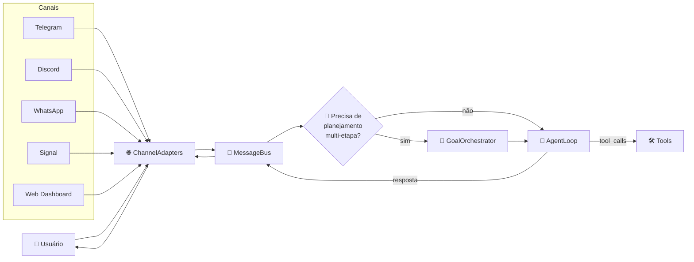
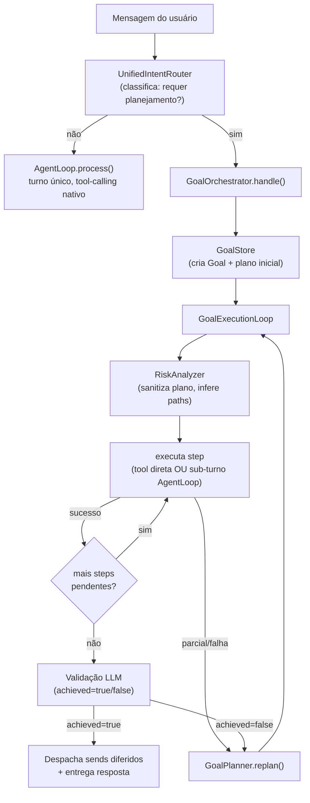
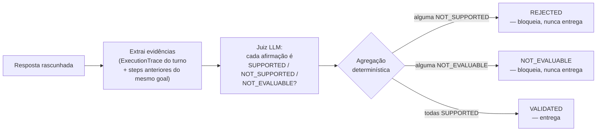
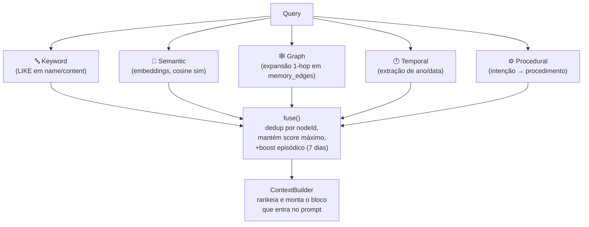
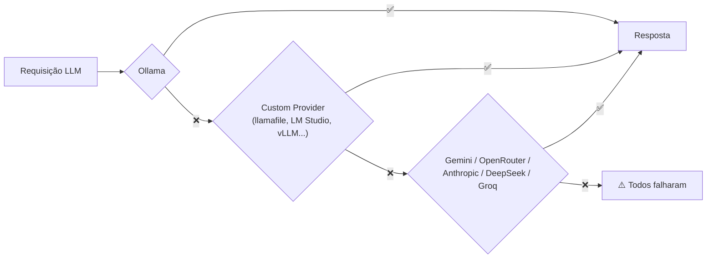

# NewClaw — Visão Técnica 🪐

> **Idioma:** [English](TECHNICAL_OVERVIEW.md) | 🇧🇷 **Português** | [Español](TECHNICAL_OVERVIEW.es.md)

> Este documento é o complemento técnico do [README](../README.pt-br.md). O README responde "o que
> o NewClaw faz por você"; este documento responde "como ele faz, por dentro". Escrito para quem
> vai ler o código, contribuir, ou só entender por que uma decisão de arquitetura existe.
>
> Referência normativa completa: [docs/ARCHITECTURE.md](ARCHITECTURE.md) (filosofia de canais) e
> [docs/ARCHITECTURE/](ARCHITECTURE/) (princípios arquiteturais + ADRs em `docs/decisoes/`).

---

## Filosofia: Core de IA, canais são só portas

O NewClaw não é um bot de Telegram, WhatsApp ou um dashboard web. É um **Core de IA** (memória,
planejamento, ferramentas, execução) que se comunica através de canais — nenhum deles contém
lógica de IA. `src/loop/**` nunca importa um `*Adapter`; nenhum `*Adapter` nunca importa
`AgentLoop`/`GoalOrchestrator`/`ToolRegistry`. Essa fronteira é verificável por `grep` e é tratada
como bug de arquitetura, não de estilo, se for violada.

Todo canal produz uma `NormalizedMessage` na entrada e consome uma `NormalizedResponse` na saída;
o pré-processamento de mídia (`agentMediaHandlers`) produz **fatos** — nunca decide o que a IA vai
ver, nunca redige a resposta.

---

## Dois modos de execução: conversa direta vs. objetivo com plano

O `MessageBus` decide, por mensagem, se ela vai direto ao `AgentLoop` (conversa simples, uma
pergunta que uma ferramenta resolve) ou se abre um **Goal** — um objetivo com plano de múltiplas
etapas, replanejamento e validação antes de entregar a resposta.

**Por que dois caminhos, não um só:** a maioria das mensagens ("oi", "que horas são", "qual a
previsão do tempo") não precisa de plano, replanejamento nem validação por LLM — isso seria
latência e custo desperdiçados. O `Goal` existe para tarefas que genuinamente precisam de múltiplas
etapas coordenadas (pesquisar → calcular → gerar arquivo → enviar), com estado persistido em SQLite
(`GoalStore`) para sobreviver a restarts.

Cada `Goal` carrega `planGeneration` — um contador que avança a cada substituição *total* do plano
(replan real, não um retry do mesmo step). É a chave de junção `(planGeneration, planStepId)` que
impede um `attempt` de uma estratégia já abandonada de "vencer" um attempt da estratégia vigente
só por ter sido inserido antes no array.

---

## A barreira de groundedness (ADR-010)

Depois que o `AgentLoop` produz uma resposta final, ela passa por **dois** gates independentes
antes de chegar ao usuário — contratos irmãos, um não substitui o outro:

| Gate | Pergunta que responde |
|---|---|
| **ResponseCommit** (Q4) | A ferramenta foi realmente executada, ou o agente está alucinando uma ação? |
| **Groundedness** (C1, ADR-010) | Os números/fatos na resposta batem com o que a ferramenta devolveu? |

O gate de groundedness extrai cada afirmação factual da resposta e classifica contra a evidência
real do turno (`ExecutionTrace`) usando um juiz LLM dedicado:

Regra central: **ausência de contradição não é suporte**. Se a evidência não determina a
afirmação, o veredito é `NOT_EVALUABLE`, nunca `SUPPORTED` — um número presente na evidência sem a
unidade determinada não sustenta "está a 25°C". Falha do próprio juiz (timeout, saída malformada,
provedor indisponível) vira `UNVALIDATED` e **também bloqueia** — o gate é fail-closed por design,
nunca fail-open.

A evidência inclui tanto o `ExecutionTrace` do turno atual quanto — quando o turno roda como *step*
de um `Goal` — fatos reais (`result='success'`) de steps anteriores da mesma `planGeneration`, para
que o juiz não bloqueie uma afirmação que reaproveita legitimamente um valor já obtido antes, em
vez de re-consultar a ferramenta à toa.

Este é o mecanismo concreto por trás do princípio geral do projeto: **determinismo valida, LLM
interpreta.** Groundedness é uma pergunta semântica ("isto é sustentado?") — por isso o mecanismo é
um LLM, não regex. Mas a agregação de vereditos em um estado final é uma pergunta estrutural
(precedência sobre um enum fechado) — por isso é determinística. Ver
[docs/ARCHITECTURE/RESPONSABILIDADE_ANTES_DO_MECANISMO.md](ARCHITECTURE/RESPONSABILIDADE_ANTES_DO_MECANISMO.md).

---

## Memória semântica

Armazenamento: **SQLite** (`better-sqlite3`) com **FTS5** para busca textual e uma tabela dedicada
de embeddings (via Ollama, `nomic-embed-text` por padrão, 768 dimensões — armazenados como BLOB,
sem dependência de extensão vetorial nativa).

**Tipos de nó:** `identity`, `preference`, `project`, `context`, `fact`, `skill`,
`infrastructure`, `trait`, `rule`, `strategy`, `knowledge`, `domain`. Cada nó carrega
`confidence`, `pagerank`/`degree`/`community_id` (métricas de grafo) e um `LifecycleState`
(`ACTIVE → SUMMARIZED → ARCHIVED/EXPIRED/SUPERSEDED`).

### Recuperação em múltiplas camadas

O `ContextBuilder` decide o que efetivamente entra no prompt do LLM: ranking declarado como
`similaridade*0.6 + conectividade*0.25 + recência*0.15`, selecionando tipicamente 5-8 nós, dentro
de um orçamento de tokens por bloco (`ContextBudget`: ~1500 tokens de system prompt, ~1000 de
memória, ~2000 de histórico recente — números indicativos, ajustáveis por `tier`).

### Distribuído × Aprendido

Uma fronteira normativa que atravessa todo o sistema de memória e conhecimento (ver
[SEPARACAO_DISTRIBUIDO_APRENDIDO.md](ARCHITECTURE/SEPARACAO_DISTRIBUIDO_APRENDIDO.md)):

| | **Distribuído** | **Aprendido** |
|---|---|---|
| Onde vive | Código-fonte versionado (ex: `KNOWN_DEPS` em `GoalEvaluator.ts`) | SQLite local da instância |
| Como muda | PR humano, revisado | Runtime, automático |
| Exemplo | Comandos de instalação conhecidos e validados | `ReflectionMemory`, `CaseMemory`, `OperationalKnowledge` |

Um fato aprendido **nunca** se auto-promove ao catálogo distribuído — a única travessia legítima é
um PR humano manual lendo a evidência aprendida e decidindo incorporá-la ao código.

### Memória pós-execução

- **`ReflectionMemory`** — persiste o resultado de cada validação (`ObserverValidator`), agrega
  padrões de erro por ferramenta, injeta um resumo (`buildContextHint()`) no prompt quando a taxa
  de falha de uma tool passa de um limiar.
- **`CaseMemory`** — captura casos de sucesso comprovado (critério de sucesso atingido ou artefato
  realmente entregue). Hoje em **modo sombra**: não influencia `GoalPlanner`, `RiskAnalyzer` nem
  escolha de ferramentas — só captura e permite consulta diagnóstica.
- **`OperationalKnowledge`** — comandos de instalação aprendidos em runtime quando uma dependência
  ausente é resolvida com sucesso, chaveados por `(ferramenta, plataforma)`.

---

## Ferramentas

| Categoria | Ferramentas |
|---|---|
| **Memória** | `memory_search`, `memory_write`, `memory_admin`, `manage_memory`, `cmi_inspect` |
| **Web** | `web_search`, `web_navigate` (usa `w3m`/`lynx`/`links`/`elinks` quando disponível, fallback HTML), `api_request` |
| **Sistema/arquivos** | `exec_command`, `ssh_exec`, `read`, `write`, `edit`, `read_document`, `list_workspace`, `organize_workspace`, `refresh_workspace`, `analyze_workspace_groups`, `schedule` |
| **Mídia/documentos** | `send_document`, `send_audio`, `powerpoint_control` |
| **Dados/financeiro** | `crypto_analysis`, `crypto_report`, `weather` |

Ferramentas perigosas (`exec_command`, `ssh_exec`, `api_request` contra hosts arbitrários) exigem
autorização — ver seção de modos abaixo.

---

## Skills

Uma skill é um `SKILL.md` com frontmatter YAML (`name`, `description`, `triggers`, `tools`,
`tags`) carregado por `SkillLoader` (cache de 10s). `SkillDiscovery` casa a mensagem do usuário
contra as `tags`/`triggers` de cada skill via interseção de tokens normalizados — sem embeddings,
sem chamada de LLM extra só para descobrir qual skill é relevante.

Skills instaladas hoje:

| Skill | O que faz |
|---|---|
| `content-validator` | Valida sintaxe de arquivos gerados (HTML/JS/Python/JSON) e faz revisão visual de artefatos renderizados antes de enviar |
| `dependency-curator` | Pesquisa comandos de instalação cross-platform com fonte citada — nunca instala, produz relatório para aprovação humana |
| `html-pdf-converter` | Converte HTML (inclusive slides com JS) para PDF |
| `pptx-generator` | Converte Markdown/HTML em `.pptx` editável |
| `skill-auditor` | Audita skills de terceiros por segurança (prompt injection, exfiltração) — análise estática, nunca executa |
| `skill-manager` | Instala e gerencia skills a partir de repositórios/`skills.sh` |
| `system-provisioner` | Instala dependências de sistema (pip, npm, apt) |

---

## Provedores de LLM e roteamento por modelo

### Cadeia de fallback

Ordem real (`ProviderFactory.getFallbackOrder`): o provider preferido (se houver) vai primeiro;
senão `['ollama', 'openrouter', 'anthropic', 'gemini', 'deepseek', 'groq']`, filtrada pelo que
está de fato configurado, com custom providers anexados ao final. `DEFAULT_PROVIDER` no `.env`
tem prioridade sobre essa ordem quando definido.

### Roteamento por categoria

Cada chamada de LLM é roteada para um perfil de modelo por categoria — não é "um modelo para
tudo":

| Categoria | Uso típico |
|---|---|
| `chat` | Conversa geral, raciocínio |
| `code` | Programação, edição de arquivos, scripts |
| `vision` | Análise de imagem, OCR |
| `light` | Respostas curtas (oi, ok, obrigado) |
| `analysis` | Cripto, dados de mercado, estatística |
| `execution` | Loops de ferramentas complexos, múltiplas etapas |

A classificação é primeiro **determinística** (regex/keyword contra `FallbackRule[]`, 0ms) — um
LLM leve entra só como fallback para casos ambíguos. Cada categoria pode ter seu próprio
`PROVIDER_<CATEGORIA>` no `.env`; se vazio, herda `DEFAULT_PROVIDER`.

### 🖥️ Modelos locais offline — llamafile e `.gguf`

Além de Ollama/nuvem, o NewClaw roda **modelos `.gguf` totalmente offline** via
[llamafile](https://github.com/Mozilla-Ocho/llamafile)/`llama-server` — sem depender de nenhum
serviço externo, nem do próprio Ollama.

- Aponte `LOCAL_MODELS_DIR` (no `.env` ou pelo Dashboard) para a pasta onde você guarda seus
  arquivos `.gguf`. O NewClaw varre a pasta e lista os modelos encontrados.
- Ao escolher "usar este modelo" no Dashboard, o NewClaw sobe (`spawn`, sem shell — sem risco de
  injeção de comando) um processo `llamafile`/`llama-server` local, servindo um endpoint
  OpenAI-compatible na porta configurada (`LOCAL_SERVER_PORT`, padrão `8080`).
- Esse endpoint passa a se comportar como **mais um provider** na cadeia de fallback — pode ser
  definido como `DEFAULT_PROVIDER`, atribuído a categorias específicas via `PROVIDER_<CATEGORIA>`,
  ou ficar como fallback silencioso se o resto falhar.
- Modelos locais adicionados manualmente via `CUSTOM_PROVIDERS`/`CUSTOM_MODELS` (JSON no `.env`)
  seguem o mesmo contrato — qualquer servidor OpenAI-compatible (LM Studio, vLLM, um llamafile já
  em execução em outra máquina da rede) entra do mesmo jeito, sem código novo.

É o caminho para rodar o NewClaw **sem internet, sem conta em provider nenhum, sem custo por
token** — só a máquina local e um arquivo `.gguf`.

---

## Sessões e contexto

| Componente | Responsabilidade |
|---|---|
| **SessionManager** | Isola sessões por `canal:usuário`, mutex por sessão (evita corrupção concorrente), compressão híbrida (contagem de mensagens OU estimativa de tokens) |
| **SessionTranscript** | Log JSONL append-only, um arquivo por sessão, com índice de seek para replay rápido desde o último checkpoint |
| **SessionContext** | Monta o contexto do turno como blocos separados (system prompt → estado → memória → checkpoint → histórico recente → mensagem atual) — nunca uma concatenação monolítica |
| **SessionKeyFactory** | Fonte única para compor/decompor `canal:usuário` — existe porque múltiplos consumidores faziam isso de forma independente, truncando silenciosamente `userId`s que continham `:` |
| **SkillLearner/SessionLearner** | Extrai fatos da conversa (nomes, preferências, projetos) para o grafo de memória |

---

## Autorização e modos de operação

Três modos (`CapabilityMode`), cada um controlando uma matriz de capacidades
(`auto_approve_exec`, `install_dependencies`, `modify_core`, `access_secrets`, ...):

| Modo | Comportamento |
|---|---|
| **SAFE** | Nada é auto-aprovado — toda ação perigosa pede confirmação |
| **DEVELOPER** | Autonomia intermediária |
| **GOD** | Autonomia total — mesmo assim, proteções absolutas continuam valendo |

**Proteções absolutas, em qualquer modo:** audit log completo, bloqueio incondicional de comandos
catastróficos (`rm -rf /`, `mkfs`, `dd if=`, fork bomb, `shutdown`/`reboot` — detecção estrutural
em `src/shared/destructiveCommandPatterns.ts`, nunca via LLM), confirmação obrigatória para
exclusão em massa, remoção de diretório, ou acesso a credenciais/secrets.

O gate de "esta ação precisa de autorização?" vive num único lugar
(`ToolRegistry.requiresAuthorization()`), consultado tanto pelo `AgentLoop` (turno conversacional)
quanto pelo `GoalExecutionLoop` (step de plano) — consolidado depois de um bug real em que a regra
só existia no primeiro caminho, deixando um `exec_command` perigoso escapar sem gate quando vinha
de dentro de um plano de goal em modo SAFE.

Quando uma ação exige aprovação, o `WorkflowEngine` cria uma transação e o canal (Telegram,
Discord, WhatsApp, Signal) mostra botões de aprovar/rejeitar que respondem **fora** do pipeline
conversacional — sem regex, sem replay de contexto, direto ao motor de workflow.

---

## Dashboard

Muito além de um chat: grafo de memória completo (visualização, CRUD de nós/arestas, snapshots
versionados, analytics), catálogo e instalação de modelos (nuvem e locais), gestão de providers
(incluindo custom OpenAI-compatible), skills (instalação, auto-descoberta com aprovação humana),
modo de capacidade, perfil e audit log do owner, backup/restore agendado, e trace completo de
execução de cada turno.

---

## Onde ir a partir daqui

- [docs/ARCHITECTURE.md](ARCHITECTURE.md) — filosofia de canais, o que é proibido importar onde, como adicionar um canal novo
- [docs/ARCHITECTURE/](ARCHITECTURE/) — princípios normativos (Evidence Provider Pattern, Nunca Adivinhar, Responsabilidade antes do Mecanismo, Localidade da Recuperação, Soberania da Configuração)
- [docs/decisoes/](decisoes/) — ADRs numerados (decisões pontuais, cada uma com o incidente real que a motivou) e RFCs
- [docs/ROADMAP.md](ROADMAP.md) — visão de futuro
